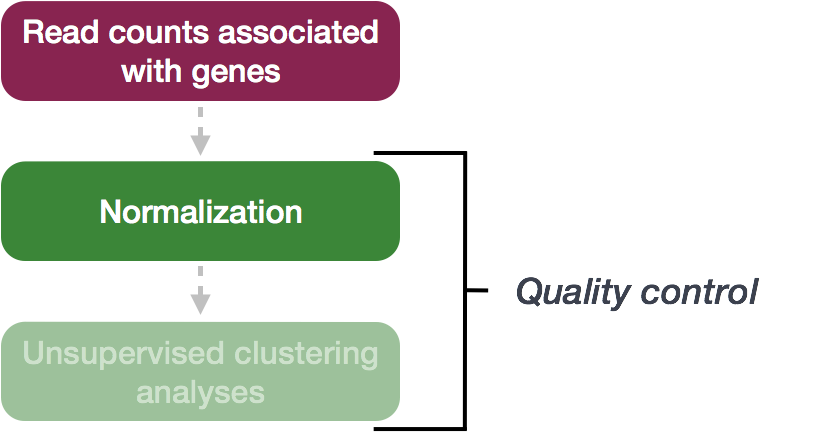
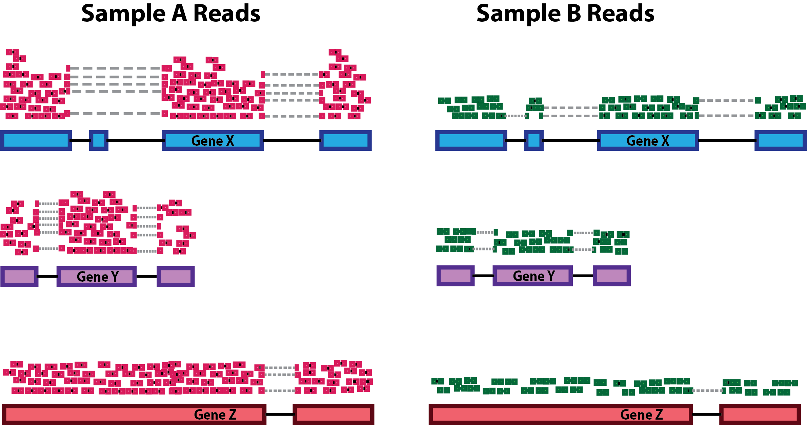
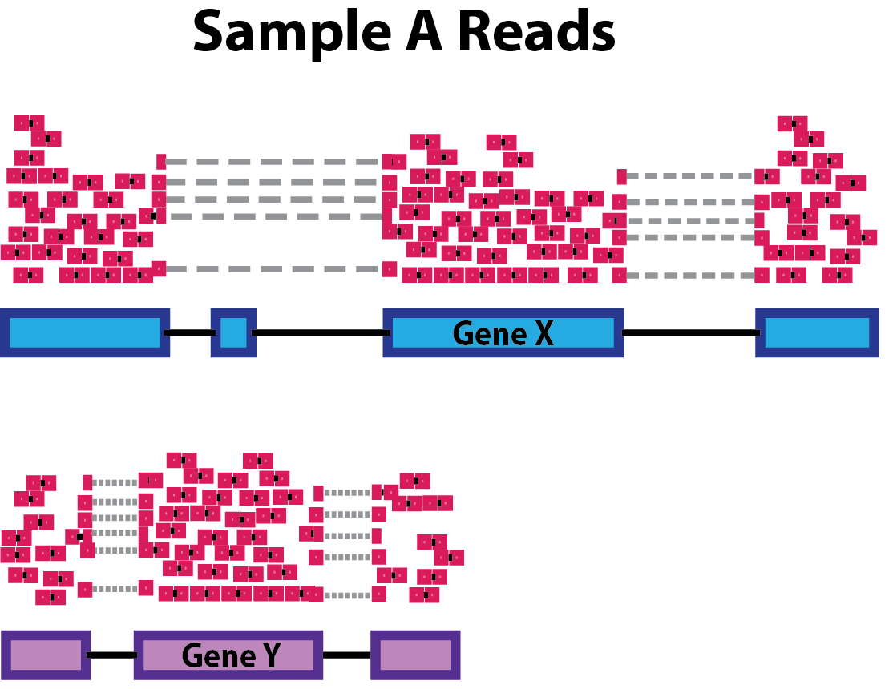
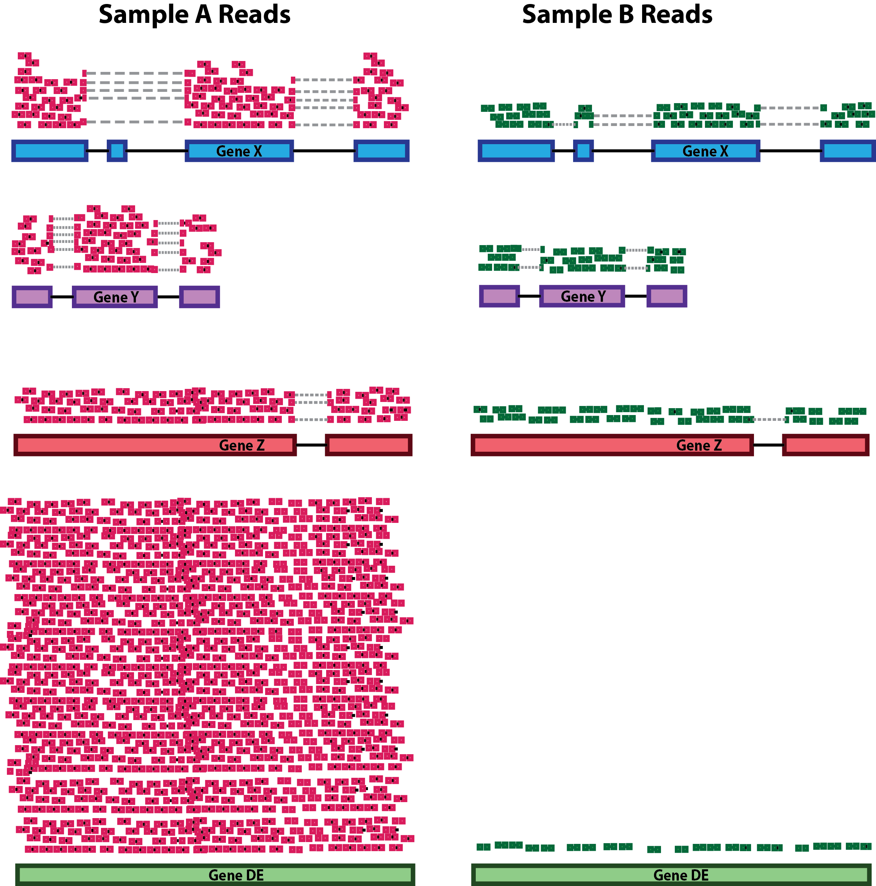

Approximate time: 60 minutes

## Learning Objectives 

* Explore different types of normalization methods
* Become familiar with the `DESeqDataSet` object 
* Understand how to normalize counts using DESeq2

## Normalization

The first step in the DE analysis workflow is count normalization, which is necessary to make accurate comparisons of gene expression between samples.



The counts of mapped reads for each gene is proportional to the expression of RNA ("interesting") in addition to many other factors ("uninteresting"). Normalization is the process of scaling raw count values to account for the "uninteresting" factors. In this way the expression levels are more comparable between and/or within samples.

The main factors often considered during normalization are:
 
 - **Sequencing depth:** Accounting for sequencing depth is necessary for comparison of gene expression between samples. In the example below, each gene appears to have doubled in expression in *Sample A* relative to *Sample B*, however this is a consequence of *Sample A* having double the sequencing depth. 

    
  
	>***NOTE:** In the figure above, each pink and green rectangle represents a read aligned to a gene. Reads connected by dashed lines connect a read spanning an intron.*
 
 - **Gene length:** Accounting for gene length is necessary for comparing expression between different genes within the same sample. In the example, *Gene X* and *Gene Y* have similar levels of expression, but the number of reads mapped to *Gene X* would be many more than the number mapped to *Gene Y* because *Gene X* is longer.
 
    
 
 - **RNA composition:** A few highly differentially expressed genes between samples, differences in the number of genes expressed between samples, or presence of contamination can skew some types of normalization methods. Accounting for RNA composition is recommended for accurate comparison of expression between samples, and is particularly important when performing differential expression analyses [[1](https://genomebiology.biomedcentral.com/articles/10.1186/gb-2010-11-10-r106)]. 
 
	In the example, if we were to divide each sample by the total number of counts to normalize, the counts would be greatly skewed by the DE gene, which takes up most of the counts for *Sample A*, but not *Sample B*. Most other genes for *Sample A* would be divided by the larger number of total counts and appear to be less expressed than those same genes in *Sample B*.  
	
    
    
***While normalization is essential for differential expression analyses, it is also necessary for exploratory data analysis, visualization of data, and whenever you are exploring or comparing counts between or within samples.***
 
### Common normalization methods

Several common normalization methods exist to account for these differences:
	
| Normalization method | Description | Accounted factors | Recommendations for use |
| ---- | ---- | ---- | ---- |
| **CPM** (counts per million) | counts scaled by total number of reads | sequencing depth | gene count comparisons between replicates of the same samplegroup; **NOT for within sample comparisons or DE analysis**  |
| **TPM** (transcripts per kilobase million) | counts per length of transcript (kb) per million reads mapped | sequencing depth and gene length | gene count comparisons within a sample or between samples of the same sample group; **NOT for DE analysis** |
| **RPKM/FPKM** (reads/fragments per kilobase of exon per million reads/fragments mapped) | similar to TPM | sequencing depth and gene length | gene count comparisons between genes within a sample; **NOT for between sample comparisons or DE analysis** |
| DESeq2's **median of ratios** [[1](https://genomebiology.biomedcentral.com/articles/10.1186/gb-2010-11-10-r106)] | counts divided by sample-specific size factors determined by median ratio of gene counts relative to geometric mean per gene | sequencing depth and RNA composition | gene count comparisons between samples and for **DE analysis**; **NOT for within sample comparisons** |
| EdgeR's **trimmed mean of M values (TMM)** [[2](https://genomebiology.biomedcentral.com/articles/10.1186/gb-2010-11-3-r25)] | uses a weighted trimmed mean of the log expression ratios between samples | sequencing depth, RNA composition | gene count comparisons between samples and for **DE analysis**; **NOT for within sample comparisons** |


### RPKM/FPKM (not recommended)
While TPM and RPKM/FPKM normalization methods both account for sequencing depth and gene length, RPKM/FPKM are not recommended. **The reason  is that the normalized count values output by the RPKM/FPKM method are not comparable between samples.** 

Using RPKM/FPKM normalization, the total number of RPKM/FPKM normalized counts for each sample will be different. Therefore, you cannot compare the normalized counts for each gene equally between samples. 

**RPKM-normalized counts table**

| gene | sampleA | sampleB |
| ----- |:-----:|:-----:|
| XCR1 | 5.5 | 5.5 |
| WASHC1 | 73.4 | 21.8 |
| ... | ... | ... |
|Total RPKM-normalized counts | 1,000,000 | 1,500,000 |

For example, in the table above, SampleA has a greater proportion of counts associated with XCR1 (5.5/1,000,000) than does sampleB (5.5/1,500,000) even though the RPKM count values are the same. Therefore, we cannot directly compare the counts for XCR1 (or any other gene) between sampleA and sampleB because the total number of normalized counts are different between samples. 

### DESeq2-normalized counts: Median of ratios method
Since tools for differential expression analysis are comparing the counts between sample groups for the same gene, gene length does not need to be accounted for by the tool. However, **sequencing depth** and **RNA composition** do need to be taken into account.

To normalize for sequencing depth and RNA composition, DESeq2 uses the median of ratios method. On the user-end there is only one step, but on the back-end there are multiple steps involved, as described below.

> **NOTE:**  The steps below describe in detail some of the steps performed by DESeq2 when you run a single function to get DE genes. Basically, for a typical RNA-seq analysis, **you would not run these steps individually**.

**Step 1: creates a pseudo-reference sample (row-wise geometric mean)**

For each gene, a pseudo-reference sample is created that is equal to the geometric mean across all samples.

| gene | sampleA | sampleB | pseudo-reference sample  |
| ----- |:-----:|:-----:|:-----:|
| EF2A | 1489 | 906 | sqrt(1489 * 906) = **1161.5** |
| ABCD1 | 22 | 13 | sqrt(22 * 13) = **17.7** |
| ... | ... | ... | ... |

**Step 2: calculates ratio of each sample to the reference**

For every gene in a sample, the ratios (sample/ref) are calculated (as shown below). This is performed for each sample in the dataset. Since the majority of genes are not differentially expressed, the majority of genes in each sample should have similar ratios within the sample.

| gene | sampleA | sampleB | pseudo-reference sample  | ratio of sampleA/ref | ratio of sampleB/ref |
| ----- |:-----:|:-----:|:-----:| :-----: | :-----: |
| EF2A | 1489 | 906 | 1161.5 | 1489/1161.5 = **1.28** | 906/1161.5 = **0.78** |
| ABCD1 | 22 | 13 | 16.9 | 22/16.9 = **1.30** | 13/16.9 = **0.77** |
| MEFV | 793 | 410 | 570.2 | 793/570.2 = **1.39** | 410/570.2 = **0.72**
| BAG1 | 76 | 42 | 56.5 | 76/56.5 = **1.35** | 42/56.5 = **0.74**
| MOV10 | 521 | 1196 | 883.7 | 521/883.7 = **0.590** | 1196/883.7 = **1.35** |
| ... | ... | ... | ... |

**Step 3: calculate the normalization factor for each sample (size factor)**

The median value (column-wise for the above table) of all ratios for a given sample is taken as the normalization factor (size factor) for that sample, as calculated below. Notice that the differentially expressed genes should not affect the median value:

`normalization_factor_sampleA <- median(c(1.28, 1.3, 1.39, 1.35, 0.59))`

`normalization_factor_sampleB <- median(c(0.78, 0.77, 0.72, 0.74, 1.35))`
 
The figure below illustrates the median value for the distribution of all gene ratios for a single sample (frequency is on the y-axis).


The median of ratios method makes the assumption that not ALL genes are differentially expressed; therefore, the normalization factors should account for sequencing depth and RNA composition of the sample (large outlier genes will not represent the median ratio values). **This method is robust to imbalance in up-/down-regulation and large numbers of differentially expressed genes.**

> Usually these size factors are around 1, if you see large variations between samples it is important to take note since it might indicate the presence of extreme outliers.

**Step 4: calculate the normalized count values using the normalization factor**

This is performed by dividing each raw count value in a given sample by that sample's normalization factor to generate normalized count values. This is performed for all count values (every gene in every sample). For example, if the median ratio for SampleA was 1.3 and the median ratio for SampleB was 0.77, you could calculate normalized counts as follows:

SampleA median ratio = 1.3

SampleB median ratio = 0.77

**Raw Counts**

| gene | sampleA | sampleB |  
| ----- |:-----:|:-----:|
| EF2A | 1489 | 906 | 
| ABCD1 | 22 | 13 | 
| ... | ... | ... | 

**Normalized Counts**

| gene | sampleA | sampleB |
| ----- |:-----:|:-----:|
| EF2A | 1489 / 1.3 = **1145.39** | 906 / 0.77 = **1176.62** | 
| ABCD1 | 22 / 1.3 = **16.92** | 13 / 0.77 = **16.88** | 
| ... | ... | ... | 

> Please note that normalized count values are not whole numbers.

***
**Exercise**

Determine the normalized counts for your gene of interest, PD1, given the raw counts and size factors below. 

NOTE: You will need to run the code below to generate the raw counts dataframe (PD1) and the size factor vector (size_factors), then use these objects to determine the normalized counts values:

```r

# Raw counts for PD1
PD1 <- c(21, 58, 17, 97, 83, 10)
names(PD1) <- paste0("Sample", 1:6)
PD1 <- data.frame(PD1)
PD1 <- t(PD1)

# Size factors for each sample
size_factors <- c(1.32, 0.70, 1.04, 1.27, 1.11, 0.85)

```

***

## Count normalization of Mov10 dataset using DESeq2

Now that we know the theory of count normalization, we will normalize the counts for the Mov10 dataset using DESeq2. This requires a few steps:

1. Ensure the row names of the metadata dataframe are present and in the same order as the column names of the counts dataframe.
2. Create a `DESeqDataSet` object
3. Generate the normalized counts

### 1. Match the metadata and counts data

We should always make sure that we have sample names that match between the two files, and that the samples are in the right order. DESeq2 will output an error if this is not the case.

```r
### Check that sample names match in both files
all(colnames(data) %in% rownames(meta))
all(colnames(data) == rownames(meta))
```

If your data did not match, you could use the `match()` function to rearrange them to be matching.

***

**Exercise**	

Suppose we had sample names matching in the counts matrix and metadata file, but they were out of order. Write the line(s) of code required to create a new matrix with columns ordered such that they were identical to the row names of the metadata.

*** 

### 2. Create DESEq2 object

Bioconductor software packages often define and use a custom class within R for storing data (input data, intermediate data and also results). These custom data structures are similar to `lists` in that they can contain multiple different data types/structures within them. But, unlike lists they have pre-specified `data slots`, which hold specific types/classes of data. The data stored in these pre-specified slots can be accessed by using specific package-defined functions.

Let's start by creating the `DESeqDataSet` object and then we can talk a bit more about what is stored inside it. To create the object we will need the **count matrix** and the **metadata** table as input. We will also need to specify a **design formula**. The design formula specifies the column(s) in the metadata table and how they should be used in the analysis. For our dataset we only have one column we are interested in, that is `~sampletype`. This column has three factor levels, which tells DESeq2 that for each gene we want to evaluate gene expression change with respect to these different levels.

```r
## Create DESeq2Dataset object
dds <- DESeqDataSetFromMatrix(countData = data, colData = meta, design = ~ sampletype)
```


You can use DESeq-specific functions to access the different slots and retrieve information, if you wish. For example, suppose we wanted the original count matrix we would use `counts()` (*Note: we nested it within the `View()` function so that rather than getting printed in the console we can see it in the script editor*) :

```r
View(counts(dds))
```

As we go through the workflow we will use the relevant functions to check what information gets stored inside our object.

### 3. Generate the Mov10 normalized counts

The next step is to normalize the count data in order to be able to make fair gene comparisons between samples.


To perform the **median of ratios method** of normalization, DESeq2 has a single `estimateSizeFactors()` function that will generate size factors for us. We will use the function in the example below, but **in a typical RNA-seq analysis this step is automatically performed by the `DESeq()` function**, which we will see later. 

```r
dds <- estimateSizeFactors(dds)
```

By assigning the results back to the `dds` object we are filling in the slots of the `DESeqDataSet` object with the appropriate information. We can take a look at the normalization factor applied to each sample using:

```r
sizeFactors(dds)
```

Now, to retrieve the normalized counts matrix from `dds`, we use the `counts()` function and add the argument `normalized=TRUE`.

```r
normalized_counts <- counts(dds, normalized=TRUE)
```

We can save this normalized data matrix to file for later use:

```r
write.table(normalized_counts, file="data/normalized_counts.txt", sep="\t", quote=F, col.names=NA)
```

> **NOTE:** DESeq2 doesn't actually use normalized counts, rather it uses the raw counts and models the normalization inside the Generalized Linear Model (GLM). These normalized counts will be useful for downstream visualization of results, but cannot be used as input to DESeq2 or any other tools that peform differential expression analysis which use the negative binomial model.

***
*This lesson has been developed by members of the teaching team at the [Harvard Chan Bioinformatics Core (HBC)](http://bioinformatics.sph.harvard.edu/). These are open access materials distributed under the terms of the [Creative Commons Attribution license](https://creativecommons.org/licenses/by/4.0/) (CC BY 4.0), which permits unrestricted use, distribution, and reproduction in any medium, provided the original author and source are credited.*
