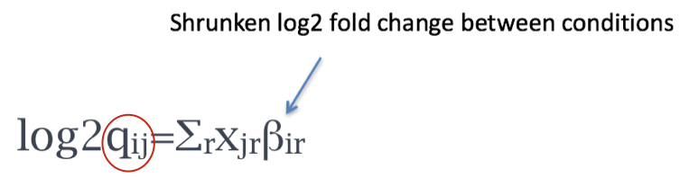

Approximate time: 60 minutes

## Learning Objectives 

* Understanding the different steps in a differential expression analysis in the context of DESeq2
* Building results tables for comparison of different sample classes


# Differential expression analysis with DESeq2

The final step in the differential expression workflow is the actual fitting of the raw counts to the statistical model and testing for differentially expressed genes. Essentially we want to determine whether the mean expression levels of different sample groups are significantly different.


DESeq2 builds on good ideas for dispersion estimation and use of Generalized Linear Models from the DSS and edgeR methods. The [DESeq2 paper](https://genomebiology.biomedcentral.com/articles/10.1186/s13059-014-0550-8) was published in 2014, but the package is continually updated and available for use in R through Bioconductor.

Differential expression analysis with DESeq2 requires multiple steps, as displayed below. During the analysis, DESeq2 will model the raw counts, using normalization factors (size factors) to account for differences in library depth and composition. Then DESeq2 will estimate the gene-wise dispersions and shrink these estimates to generate more accurate estimates of dispersion to model the counts. Finally, DESeq2 will fit the negative binomial model and perform hypothesis testing using the Wald test or Likelihood Ratio Test.


Prior to performing the differential expression analysis, it is a good idea to know what sources of variation are present in your data, either by exploration during the QC and/or prior knowledge. Once you know the major sources of variation, you can remove them prior to analysis or control for them in the statistical model. 

## Design formula
You can specify the sources of variation in your DESeq2 model using a **design formula**. A design formula tells the statistical software which sources of variation to control for, as well as, the factor of interest to test for differential expression. For example, if you know that sex is a significant source of variation in your data, then `sex` should be included in your model. The **design formula** should have **all of the factors in your metadata that account for major sources of variation** in your data. **The last factor entered in the formula should be the condition of interest.**

For example, suppose you have the following metadata:


If you want to examine the expression differences between treatments, and you know that major sources of variation include `sex` and `age`, then your design formula would be:

`design <- ~ sex + age + treatment`

The tilde (`~`) should always proceed your factors and tells DESeq2 to model the counts using the following formula. Note the **factors included in the design formula need to match the column names in the metadata**. 

***
**Exercises**

1. Suppose you wanted to study the expression difference between the two age groups in the metadata shown above, and major sources of variation were `sex` and `treatment`, how would the design formula be written?
2. Based on our **Mov10** `metadata` dataframe, which factors could we include in our design formula?
3. What would you do if you wanted to include a factor in your design formula that is not in your metadata? 

***

### Complex designs

DESeq2 also allows for the analysis of complex designs. You can explore interactions or difference of differences by specifying for it in the design formula. For example, if you wanted to explore the effect of sex on the treatment effect, you could specify for it in the design formula as follows: 

`design <- ~ sex + age + treatment + sex:treatment`

Since the interaction term `sex:treatment` is last in the formula, the results output from DESeq2 will output results for this term. Alternatively, as recommended in the [DESeq2 vignette](https://www.bioconductor.org/packages/release/bioc/vignettes/DESeq2/inst/doc/DESeq2.pdf), we could create a new factor variable in our metadata based on the two interaction factors as shown in the table below:


The design formula would be:

`design <- ~ sex + age + treatment + treat_sex`

## Running DESeq2

Now that we know how to specify the model to DESeq2, we can run the differential expression pipeline on the **raw counts**. To do this, we must create a DESeqDataSet as we did in the 'Count normalization' lesson and specify the location of our raw counts and metadata, and input our design formula:

```r
dds <- DESeqDataSetFromMatrix(countData = data, colData = meta, design = ~ sampletype)
```

To run the actual differential expression analysis, we use a single call to the function `DESeq()`. 

```r
##Run analysis
dds <- DESeq(dds)
```

By re-assigning the results of the function back to the same variable name (`dds`), we can continue to fill in the `slots` of our `DESeqDataSet` object.


**Everything from normalization to linear modeling was carried out by the use of a single function!** This function will print out a message for the various steps it performs: 

```
estimating size factors
estimating dispersions
gene-wise dispersion estimates
mean-dispersion relationship
final dispersion estimates
fitting model and testing
``` 

> **NOTE:** There are individual functions available in DESeq2 that would allow us to carry out each step in the workflow in a step-wise manner, rather than a single call. We demonstrated one example when generating size factors to create a normalized matrix. By calling `DESeq()`, the individual functions for each step are run for you.

### DESeq2 differential gene expression analysis workflow

The workflow for the differential gene expression analysis with DESeq2 is output below:


We will be taking a detailed look at each of these steps to better understand how DESeq2 is performing the statistical analysis and what metrics we should examine to explore the quality of our analysis.

### Estimate size factors

The first step in the differential expression analysis is to estimate the size factors, which is exactly what we already did to normalize the raw counts. 


DESeq2 will automatically estimate the size factors when performing the differential expression analysis if you haven't already done so. However, if you have already generated the size factors, then DESeq2 will use these values. 

To normalize the count data DESeq2 calculates size factors for each sample, using the *median of ratios method* discussed previously in the 'Count normalization' lesson. Let's take a quick look at size factor values we have for each sample:

```
sizeFactors(dds)

Mov10_kd_2 Mov10_kd_3 Mov10_oe_1 Mov10_oe_2 Mov10_oe_3 Irrel_kd_1 Irrel_kd_2 Irrel_kd_3 
 1.5646728  0.9351760  1.2016082  1.1205912  0.6534987  1.1224020  0.9625632  0.7477715  
```
 
These numbers should be identical to those we generated initially when we had run the function `estimateSizeFactors(dds)`. Take a look at the total number of reads for each sample using:

```r
colSums(counts(dds))
```

*How do the numbers correlate with the size factor?*

Now take a look at the total depth after normalization using:

```r
colSums(counts(dds, normalized=T))
```
How do the values across samples compare with the total counts taken for each sample?

> **NOTE:** It can be advantageous to calculate gene-specific normalization factors (size factors) to account for further sources of technical biases such as differing dependence on GC content, gene length or the like, and these can be supplied to DESeq2 instead of using the median of ratios method.

### Estimate gene-wise dispersion

The next step in the differential expression analysis is the estimation of gene-wise dispersions. Before we get into the details, we should have a good idea about what dispersion is referring to in DESeq2.


**What exactly is dispersion?** Dispersion is a measure of spread or variability in the data. Variance, standard deviation, IQR, among other measures, can all be used to measure dispersion. However, DESeq2 has a specific measure of dispersion (α) related to the mean (μ) and variance of the data: `Var = μ + α*μ^2`. 

**What does the DESeq2 dispersion represent?** The dispersion estimates are inversely related to the mean and directly related to variance. **Based on this relationship, the dispersion is higher for small mean counts and lower for large mean counts.** We can compare dispersion estimates to compare the variance of genes for a given mean (the dispersion estimates for genes with the same mean will differ only based on their variance). **Therefore, the dispersion estimates reflect the variance in gene expression for a given mean value.** 

The plot of mean versus variance in count data below shows the variance in gene expression increases with the mean expression (each black dot is a gene). Notice that the relationship between mean and variance is linear on the log scale, and for higher means, we could predict the variance relatively accurately given the mean. However, **for low mean counts, the variance estimates have a much larger spread (higher dispersion values)**. 


**How does the dispersion relate to our model?** To accurately model sequencing counts, we need to generate accurate estimates of within-group variation (variation between replicates of the same samplegroup) for each gene. With only a few (3-6) replicates per group, the estimates of variation for each gene are often unreliable (reason we see the high dispersion for low counts). Therefore, DESeq2 shares information across genes to generate more accurate estimates of variation based on the mean expression level of the gene using a method called 'shrinkage'. DESeq2 assumes that genes with similar expression levels have similar dispersion. 

DESeq2 generates more accurate measures of dispersion using the following steps:

1. **Estimate the dispersion for each gene separately**

	To model the dispersion based on expression level (mean counts of replicates), the dispersion for each gene is estimated using maximum likelihood estimation. In other words, **given the count values of the replicates, the most likely estimate of dispersion is calculated**.

2. **Fit a curve to the the gene estimates given expression strength**

	The idea behind fitting a curve to the data is that different genes will have different scales of biological variability, but, over all genes, there will be a distribution of reasonable estimates of dispersion. 

	This curve is displayed as a red line in the figure below, which plots the estimate for the **expected dispersion value for genes of a given expression strength**. Each black dot is a gene with an associated mean expression level and maximum likelihood estimation (MLE) of the dispersion (Step 1).

	

3. **Shrink gene-wise dispersion estimates toward the values predicted by the curve**

The next step in the workflow is to shrink the gene-wise dispersion estimates toward the expected dispersion values.


The curve allows for more accurate identification of differentially expressed genes when sample sizes are small, and the strength of the shrinkage for each gene depends on :
	
- how close gene dispersions are from the curve 
- sample size (more samples = less shrinkage)

**This shrinkage method is particularly important to reduce false positives in the differential expression analysis.** Genes with low dispersion estimates are shrunken towards the curve, and the more accurate, higher shrunken values are output for fitting of the model and differential expression testing. 

Dispersion estimates that are slightly above the curve are also shrunk toward the curve for better dispersion estimation; however, genes with extremely high dispersion values are not shrunken toward the curve due to the likelihood that the gene does not follow the modeling assumptions and has higher variability than others for biological or technical reasons [[1](https://genomebiology.biomedcentral.com/articles/10.1186/s13059-014-0550-8)]. Shrinking the values toward the curve could result in false positives, so these values are not shrunken. These genes are shown surrounded by blue circles below. 


**This is a good plot to examine to ensure your data is a good fit for the DESeq2 model.** You expect your data to generally scatter around the curve, with the dispersion decreasing with increasing mean expression levels. If you see a cloud or different shapes, then you might want to explore your data more to see if you have contamination (mitochondrial, etc.) or outlier samples.

Let's take a look at the dispersion estimates for our MOV10 data:

```r
# Plot dispersion estimates
plotDispEsts(dds)
```


 
**Since we have a small sample size, for many genes we see quite a bit of shrinkage. Do you think our data are a good fit for the model?**

## Generalized Linear Model fit for each gene

The final step in the DESeq2 workflow is fitting the Negative Binomial model for each gene and performing differential expression testing.


As discussed earlier, the count data generated by RNA-seq exhibits overdispersion (variance > mean) and the statistical distribution used to model the counts needs to account for this overdispersion. DESeq2 uses a negative binomial distribution to model the RNA-seq counts using the equation below:

 
 
DESq2 will use this formula to create the model for **each** gene, but what we really want to know is whether the log2 foldchanges between conditions is significantly different from 0. The log2 foldchanges and their standard error can be estimated using the normalized counts with the formula:

 

By fitting the model, DESeq2 will determine the **estimates for the log2 foldchanges and their standard error values for each samplegroup relative to the mean expression of all samples**. However, the log2 foldchanges are adjusted to account for the large variance associated with the estimates for low read counts, so that these genes are not included as false positives.

### Shrunken log2 foldchanges (LFC)

Generally for NGS count data, there is a large variance associated with the LFC estimates for genes with low read counts, and these weakly expressed genes would be identified as differentially expressed due solely to this variation. To account for this issue and reduce false positives for lowly expressed genes, DESeq2 shrinks the LFC estimates toward zero when the information for a gene is low, which could include:

- Low counts
- High dispersion values

Similar to the previous shrinkage of dispersion estimates, the shrinkage of LFC estimates uses information from all genes to generate more accurate estimates. Specifically, the distribution of LFC estimates for all genes is used (as a prior) to shrink the LFC estimates of genes with little information or high dispersion toward more likely (lower) LFC estimates. 


*Illustration taken from the [DESeq2 paper](https://genomebiology.biomedcentral.com/articles/10.1186/s13059-014-0550-8).*

For example, in the figure above, the green gene and purple gene have the same mean values for the two sample groups (C57BL/6J and DBA/2J), but the green gene has low variation while the purple gene has high levels of variation. For the green gene with low variation, the unshrunken LFC estimate (vertex of the green solid line) is very similar to the shrunken LFC estimate (vertex of the green dotted line), but the LFC estimates for the purple gene are quite different due to the high dispersion. So even though two genes can have similar normalized count values, they can have differing degrees of LFC shrinkage. Notice the LFC estimates are shrunken toward the prior (black solid line).


>**NOTE:** If very large expected fold changes for a number of individual genes are expected, but not so many large fold changes that the prior would not include such large fold changes, then you may want to turn off LFC shrinkage.
>
>The reason is that shrinking of fold changes requires that the software can estimate the range of reasonable values for LFC by looking at the distribution of LFCs (particularly the upper quantile of the absolute LFC). But there might be precise fold changes which are above this upper quantile, and so the prior is too narrow for the targeted genes. The prior might then be a bad assumption for this type of dataset, so it's reasonable to turn it off. *(Response from Mike Love, creator of DESeq2 (http://seqanswers.com/forums/showthread.php?t=49101))*
> 
>You can turn off the beta prior when calling the `DESeq()` fucntion: `DESeq(dds, betaPrior=FALSE)`. By turning off the prior, the log2 foldchanges would be the same as those calculated by:
>
>`log2 (normalized_counts_group1 / normalized_counts_group2)`

### Hypothesis testing using the Wald test

The shrunken LFC estimates are output for each sample group relative to the mean expression of all groups. These estimates represent the **model coefficients**, and these coefficients are calculated regardless of the comparison of interest. The model coefficients can be viewed with `coefficients(dds)` to explore the strength of the effect for each factor group relative the overall mean for every gene. 

However, generally we are interested in the LFC estimates relative to other sample groups instead of to the mean expression of all groups. To do this, we must test if the difference in the log2 fold changes between groups is zero. To determine whether the difference in shrunken LFC estimates differs significantly from zero, the **Wald test** is used. The Wald test is generally used to make pair-wise comparisons (i.e. compare the LFCs from two different conditions).

#### Creating contrasts

To indicate to DESeq2 the two groups we want to compare, we can use **contrasts** to perform differential expression testing using the Wald test. Contrasts can be provided to DESeq2 a few different ways:

1. Automatically DESeq2 will use the base factor level of the condition of interest as the base for statistical testing. 
2. Using the `results()` function, specify the factor and it's levels you would like to compare: `results(dds, contrast=c("sex", "F", "M"))`. The level given last is the base level for the comparison.
3. Instead of giving the factor and levels as a vector, you can create a list using the factor levels given in `resultsNames()`. The level given last is the base level for the comparison. For example, if the output of `resultsNames(dds)` is `"sexF", "sexM"`, then you could write the contrast as follows:
	
	```r
	
	# DO NOT RUN!
	
	contast_sex <- list("sexF", "sexM")
	
	results(dds, contrast=contrast_sex)
	
	```

> **NOTE:** The Wald test can also be used with **continuous variables**. If the variable of interest provided in the design formula is continuous-valued, then the reported log2 fold change is per unit of change of that variable.

#### Multiple test correction

If we used the `p-value` directly from the Wald test with a significance cut-off of 0.05 (α = 0.05), then 5% of all genes would be called as differentially expressed (i.e. 5% false positive genes). The more genes we test, the more 'false positives' we discover. For example, if we test 20,000 genes for differential expression, we would expect to find 1,000 false positive genes. 

DESeq2 helps reduce the number of genes tested by removing those genes unlikely to be significantly DE prior to testing, such as those with low number of counts and outlier samples (gene-level QC). However, we still need to correct for multiple testing, and there are a few common approaches:

- **Bonferroni:** The adjusted p-value is calculated by: p-value * m (m = total number of tests). **This is a very conservative approach with a high probability of false negatives.**
- **FDR / Benjamini-Hochberg:** Rank the genes by p-value, then multiply each ranked p-value by m/rank. This approach is designed to control the proportion of false positives among the set of rejected null hypotheses.
- **Q-value / Storey method:** The minimum FDR that can be attained when calling that feature significant. For example, if gene X has a q-value of 0.013 it means that 1.3% of genes that show p-values at least as small as gene X are false positives

In DESeq2, the p-values attained by the Wald test are corrected for multiple testing using the Benjamin and Hochberg method. The p-adjusted values should be used to determine significant genes. The significant genes can be output for visualization and/or functional analysis.


## Identifying gene expression changes

We have three sample classes so we can make three possible pairwise comparisons:

1. Control vs. Mov10 overexpression
2. Control vs. Mov10 knockdown
3. Mov10 knockdown vs. Mov10 overexpression

**We are really only interested in #1 and #2 from above**. Using the design formula we provided `~sampletype`, DESeq 2 internally created the following design matrix:

```
   	      Intercept  sampletypecontrol  sampletypeMOV10_knockdown  sampletypeMOV10_overexpression
Mov10_kd_2	 1	 	0		  1		 		0 
Mov10_kd_3	 1		0		  1				0
Mov10_oe_1   	 1		0		  0				1
Mov10_oe_2   	 1		0		  0				1
Mov10_oe_3   	 1		0		  0				1
Irrel_kd_1	 1		1		  0				0
Irrel_kd_2	 1		1		  0				0
Irrel_kd_3	 1		1		  0				0	

```
This design matrix is now used to setup the contrasts to request the comparisons we want to make. This information is utilized to inform the model about which replicates should be used to estimate the **log2 foldchanges (LFC)**.


### Hypothesis testing: Wald test

DESeq2 performs a hypothesis test for all possible pairwise comparisons. In order for us to retrieve the results for a specific pair of sample classes we need to provide this information to DESeq2 in the form of contrasts. While contrasts can be provided a few different ways, we will use the `list()` method:

We need to use the coefficient names to specify our comparisons, these correspond to the headers in your design matrix. To find out how the coefficients are named we can use the resultsNames() function:


```r
# Find names of coefficients
resultsNames(dds)
```

To specify the specific contrasts, we need to provide the column names from the coefficients table as a list of 2 character vectors:

```r
## Define contrasts
contrast_oe <- list( "sampletypeMOV10_overexpression", "sampletypecontrol")
```

**The order of the names, determines the direction of fold change that is reported.** The name provided in the second element is the level that is used to baseline. So for example, if we observe a log2 fold change of -2 this would mean the gene expression is lower in Mov10_oe relative to the control. Pass the contrast vector as an argument to the `results()` function:

```r
# Extract results table
res_tableOE <- results(dds, contrast=contrast_oe)
```

>**NOTE:** We could have specified the contrast in the `results()` argument:
`results(dds, contrast = c("sampletype", "MOV10_overexpression", "control	normal"))`.

This will build a results table containing Wald test statistics for the comparison we are interested in. Let's take a look at what information is stored in the results:

	head(res_tableOE)

```
log2 fold change (MAP): sampletype MOV10_overexpression vs control 
Wald test p-value: sampletype MOV10_overexpression vs control 
DataFrame with 6 rows and 6 columns
               baseMean log2FoldChange      lfcSE       stat    pvalue       padj
              <numeric>      <numeric>  <numeric>  <numeric> <numeric>  <numeric>
1/2-SBSRNA4  45.6520399     0.26976764 0.18775752  1.4367874 0.1507784 0.25242910
A1BG         61.0931017     0.20999700 0.17315013  1.2128030 0.2252051 0.34444163
A1BG-AS1    175.6658069    -0.05197768 0.12366259 -0.4203185 0.6742528 0.77216278
A1CF          0.2376919     0.02237286 0.04577046  0.4888056 0.6249793         NA
A2LD1        89.6179845     0.34598540 0.15901426  2.1758136 0.0295692 0.06725157
A2M           5.8600841    -0.27850841 0.18051805 -1.5428286 0.1228724 0.21489067
```

The results table looks very much like a dataframe and in many ways it can be treated like one (i.e when accessing/subsetting data). However, it is important to recognize that it is actually stored in a `DESeqResults` object. When we start visualizing our data, this information will be helpful. 

```r
class(res_tableOE)
```

Let's go through some of the columns in the results table to get a better idea of what we are looking at. To extract information regarding the meaning of each column we can use `mcols()`:

```r
mcols(res_tableOE, use.names=T)
```

* `baseMean`: mean of normalized counts for all samples
* `log2FoldChange`: log2 fold change
* `lfcSE`: standard error
* `stat`: Wald statistic
* `pvalue`: Wald test p-value
* `padj`: BH adjusted p-values
 
Now that we have results for the overexpression results, let's do the same for the **Control vs. Knockdown samples**. The first thing, we need to do is create a contrasts vector called `contrast_kd` for the Mov10_knockdown comparison to control.

```r
## Define contrasts
contrast_kd <- list( "sampletypeMOV10_knockdown", "sampletypecontrol")
```

Use that contrasts vector to extract a results table and store that to a variable called `res_tableKD`.  

```r
# Extract results table
res_tableKD <- results(dds, contrast=contrast_kd)
```

Take a quick peek at the results table containing Wald test statistics for the Control-Knockdown comparison we are interested in and make sure that format is similar to what we observed with the OE.

***

**Exercise**

Create a contrasts vector for the Mov10_overexpression comparison to *all other samples*.

***


> **NOTE: on p-values set to NA**
> > 
> 1. If within a row, all samples have zero counts, the baseMean column will be zero, and the log2 fold change estimates, p-value and adjusted p-value will all be set to NA.
> 2. If a row contains a sample with an extreme count outlier then the p-value and adjusted p-value will be set to NA. These outlier counts are detected by Cook’s distance. 
> 3. If a row is filtered by automatic independent filtering, for having a low mean normalized count, then only the adjusted p-value will be set to NA. 


---
*This lesson has been developed by members of the teaching team at the [Harvard Chan Bioinformatics Core (HBC)](http://bioinformatics.sph.harvard.edu/). These are open access materials distributed under the terms of the [Creative Commons Attribution license](https://creativecommons.org/licenses/by/4.0/) (CC BY 4.0), which permits unrestricted use, distribution, and reproduction in any medium, provided the original author and source are credited.*

*Some materials and hands-on activities were adapted from [RNA-seq workflow](http://www.bioconductor.org/help/workflows/rnaseqGene/#de) on the Bioconductor website*

***

 

