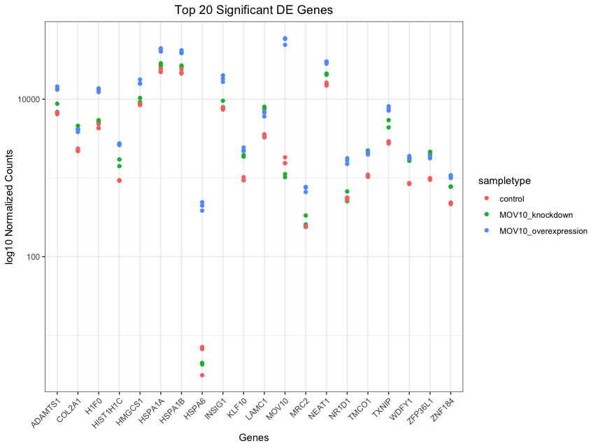
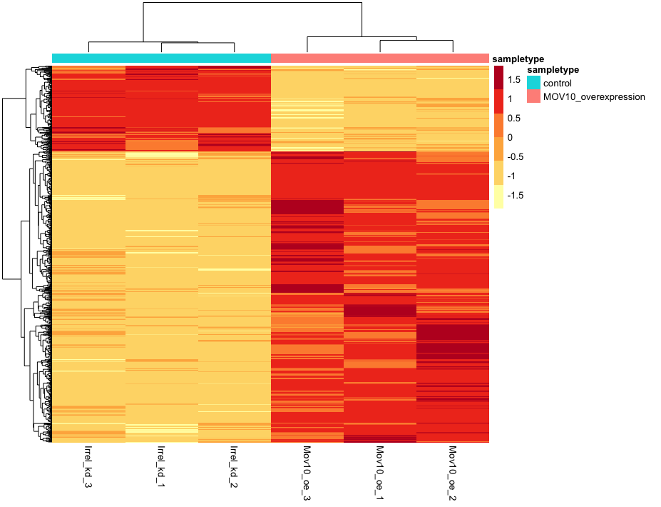
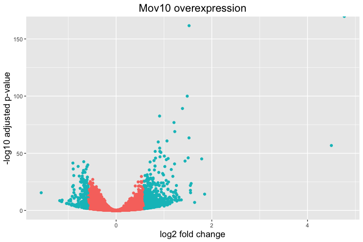
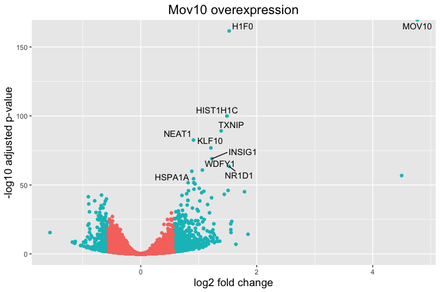

Approximate time: 75 minutes

## Learning Objectives 

* Exploring expression data using data visualization
* Using volcano plots to evaluate relationships between DEG statistics
* Plotting expression of significant genes using heatmaps

## Visualizing the results

When we are working with large amounts of data it can be useful to display that information graphically to gain more insight. During this lesson, we will get you started with some basic and more advanced plots commonly used when exploring differential gene expression data, however, many of these plots can be helpful in visualizing other types of data as well.

Let's start by loading a few libraries (if not already loaded):

```r
# load libraries
library(tidyverse)
library(ggplot2)
library(ggrepel)
library(DEGreport)
library(RColorBrewer)
library(DESeq2)
library(pheatmap)
```

We will be working with three different data objects we have already created in earlier lessons:

- Metadata for our samples (a dataframe): `meta`
- Normalized expression data for every gene in each of our samples (a matrix): `normalized_counts`
- Tibble versions of the DESeq2 results we generated in the last lesson: `res_tableOE_tb` and `res_tableKD_tb`

Let's create tibble objects from the `meta` and `normalized_counts` data frames before we start plotting. This will enable us to use the `tidyverse` functionality more easily.

```r
# Create tibbles including row names
mov10_meta <- meta %>% 
  rownames_to_column(var="samplename") %>% 
  as_tibble()
        
normalized_counts <- normalized_counts %>% 
  data.frame() %>%
  rownames_to_column(var="gene") %>% 
  as_tibble()
```

### Plotting signicant DE genes

One way to visualize results would be to simply plot the expression data for a handful of genes. We could do that by picking out specific genes of interest or selecting a range of genes.

#### **Using DESeq2 `plotCounts()` to plot expression of a single gene**

To pick out a specific gene of interest to plot, for example Mov10, we can use the `plotCounts()` from DESeq2:

```r
# Plot expression for single gene
plotCounts(dds, gene="MOV10", intgroup="sampletype") 
```


**This function only allows for plotting the counts of a single gene at a time.** 

#### **Using ggplot2 to plot expression of a single gene**

If you wish to change the appearance of this plot, we can save the output of `plotCounts()` to a variable specifying the `returnData=TRUE` argument, then use `ggplot()`:

```r
# Save plotcounts to a data frame object
d <- plotCounts(dds, gene="MOV10", intgroup="sampletype", returnData=TRUE)

# Plotting the MOV10 normalized counts, using the samplenames (rownames of d as labels)
ggplot(d, aes(x = sampletype, y = count, color = sampletype)) + 
  geom_point(position=position_jitter(w = 0.1,h = 0)) +
  geom_text_repel(aes(label = rownames(d))) + 
  theme_bw() +
  ggtitle("MOV10") +
  theme(plot.title = element_text(hjust = 0.5))
```

> Note that in the plot below (code above), we are using `geom_text_repel()` from the `ggrepel` package to label our individual points on the plot.


#### Using `ggplot2` to plot multiple genes (e.g. top 20)

Often it is helpful to check the expression of multiple genes of interest at the same time. This often first requires some data wrangling.

We are going to plot the normalized count values for the **top 20 differentially expressed genes (by padj values)**. 

To do this, we first need to determine the gene names of our top 20 genes by ordering our results and extracting the top 20 genes (by padj values):

```r
## Order results by padj values
top20_sigOE_genes <- res_tableOE_tb %>% 
        arrange(padj) %>% 	#Arrange rows by padj values
        pull(gene) %>% 		#Extract character vector of ordered genes
        .[1:20] 		#Extract the first 20 genes
```

Then, we can extract the normalized count values for these top 20 genes:

```r
## normalized counts for top 20 significant genes
top20_sigOE_norm <- normalized_counts %>%
        filter(gene %in% top20_sigOE_genes)
```

Now that we have the normalized counts for each of the top 20 genes for all 8 samples, to plot using `ggplot()`, we need to gather the counts for all samples into a single column to allow us to give ggplot the one column with the values we want it to plot.

The `gather()` function in the **tidyr** package will perform this operation and will output the normalized counts for all genes for *Mov10_oe_1* listed in the first 20 rows, followed by the normalized counts for *Mov10_oe_2* in the next 20 rows, so on and so forth.


```r
# Gathering the columns to have normalized counts to a single column
gathered_top20_sigOE <- top20_sigOE_norm %>%
  gather(colnames(top20_sigOE_norm)[2:9], key = "samplename", value = "normalized_counts")

## check the column header in the "gathered" data frame
View(gathered_top20_sigOE)
```

Now, if we want our counts colored by sample group, then we need to combine the metadata information with the melted normalized counts data into the same data frame for input to `ggplot()`:

```r
gathered_top20_sigOE <- inner_join(mov10_meta, gathered_top20_sigOE)
```

The `inner_join()` will merge 2 data frames with respect to the "samplename" column, i.e. a column with the same column name in both data frames.

Now that we have a data frame in a format that can be utilised by ggplot easily, let's plot! 

```r
## plot using ggplot2
ggplot(gathered_top20_sigOE) +
        geom_point(aes(x = gene, y = normalized_counts, color = sampletype)) +
        scale_y_log10() +
        xlab("Genes") +
        ylab("log10 Normalized Counts") +
        ggtitle("Top 20 Significant DE Genes") +
        theme_bw() +
	theme(axis.text.x = element_text(angle = 45, hjust = 1)) +
	theme(plot.title = element_text(hjust = 0.5))
```



### Heatmap

In addition to plotting subsets, we could also extract the normalized values of *all* the significant genes and plot a heatmap of their expression using `pheatmap()`.

```r
### Extract normalized expression for significant genes from the OE and control samples (4:9), and set the gene column (1) to row names
norm_OEsig <- normalized_counts[,c(1,4:9)] %>% 
              filter(gene %in% sigOE$gene) %>% 
	      data.frame() %>%
	      column_to_rownames(var = "gene") 
```

Now let's draw the heatmap using `pheatmap`:

```r
### Annotate our heatmap (optional)
annotation <- mov10_meta %>% 
	select(samplename, sampletype) %>% 
	data.frame(row.names = "samplename")

### Set a color palette
heat_colors <- brewer.pal(6, "YlOrRd")

### Run pheatmap
pheatmap(norm_OEsig, 
         color = heat_colors, 
         cluster_rows = T, 
         show_rownames = F,
         annotation = annotation, 
         border_color = NA, 
         fontsize = 10, 
         scale = "row", 
         fontsize_row = 10, 
         height = 20)
```
         
   

> *NOTE:* There are several additional arguments we have included in the function for aesthetics. One important one is `scale="row"`, in which Z-scores are plotted, rather than the actual normalized count value. 
>
> Z-scores are computed on a gene-by-gene basis by subtracting the mean and then dividing by the standard deviation. The Z-scores are computed **after the clustering**, so that it only affects the graphical aesthetics and the color visualization is improved.

### Volcano plot

The above plot would be great to look at the expression levels of a good number of genes, but for more of a global view there are other plots we can draw. A commonly used one is a volcano plot; in which you have the log transformed adjusted p-values plotted on the y-axis and log2 fold change values on the x-axis. 

To generate a volcano plot, we first need to have a column in our results data indicating whether or not the gene is considered differentially expressed based on p-adjusted values.

```r
## Obtain logical vector where TRUE values denote padj values < 0.05 and fold change > 1.5 in either direction

res_tableOE_tb <- res_tableOE_tb %>% 
                  mutate(threshold_OE = padj < 0.05 & abs(log2FoldChange) >= 0.58)
```

Now we can start plotting. The `geom_point` object is most applicable, as this is essentially a scatter plot:

```r
## Volcano plot
ggplot(res_tableOE_tb) +
        geom_point(aes(x = log2FoldChange, y = -log10(padj), colour = threshold_OE)) +
        ggtitle("Mov10 overexpression") +
        xlab("log2 fold change") + 
        ylab("-log10 adjusted p-value") +
        #scale_y_continuous(limits = c(0,50)) +
        theme(legend.position = "none",
              plot.title = element_text(size = rel(1.5), hjust = 0.5),
              axis.title = element_text(size = rel(1.25)))  
```

 

This is a great way to get an overall picture of what is going on, but what if we also wanted to know where the top 10 genes (lowest padj) in our DE list are located on this plot? We could label those dots with the gene name on the Volcano plot using `geom_text_repel()`.

First, we need to order the res_tableOE tibble by `padj`, and add an additional column to it, to include on those gene names we want to use to label the plot.
 
```r
## Create a column to indicate which genes to label
res_tableOE_tb <- res_tableOE_tb %>% arrange(padj) %>% mutate(genelabels = "")

res_tableOE_tb$genelabels[1:10] <- res_tableOE_tb$gene[1:10]

View(res_tableOE_tb)
```

Next, we plot it as before with an additiona layer for `geom_text_repel()` wherein we can specify the column of gene labels we just created. 

```r
ggplot(res_tableOE_tb, aes(x = log2FoldChange, y = -log10(padj))) +
        geom_point(aes(colour = threshold_OE)) +
        geom_text_repel(aes(label = genelabels)) +
        ggtitle("Mov10 overexpression") +
        xlab("log2 fold change") + 
        ylab("-log10 adjusted p-value") +
        theme(legend.position = "none",
              plot.title = element_text(size = rel(1.5), hjust = 0.5),
              axis.title = element_text(size = rel(1.25))) 
```

 

***

> ***NOTE:** If using the DESeq2 tool for differential expression analysis, the package 'DEGreport' can use the DESeq2 results output to make the top20 genes and the volcano plots generated above by writing a few lines of simple code. While you can customize the plots above, you may be interested in using the easier code. Below are examples of the code to create these plots:*

> ```r
> DEGreport::degPlot(dds = dds, res = res, n = 20, xs = "type", group = "condition") # dds object is output from DESeq2
> 
> DEGreport::degVolcano(
>     data.frame(res[,c("log2FoldChange","padj")]), # table - 2 columns
>     plot_text = data.frame(res[1:10,c("log2FoldChange","padj","id")])) # table to add names
>     
> # Available in the newer version for R 3.4
> DEGreport::degPlotWide(dds = dds, genes = row.names(res)[1:5], group = "condition")
> ```
***

*This lesson has been developed by members of the teaching team at the [Harvard Chan Bioinformatics Core (HBC)](http://bioinformatics.sph.harvard.edu/). These are open access materials distributed under the terms of the [Creative Commons Attribution license](https://creativecommons.org/licenses/by/4.0/) (CC BY 4.0), which permits unrestricted use, distribution, and reproduction in any medium, provided the original author and source are credited.*

* *Materials and hands-on activities were adapted from [RNA-seq workflow](http://www.bioconductor.org/help/workflows/rnaseqGene/#de) on the Bioconductor website*
