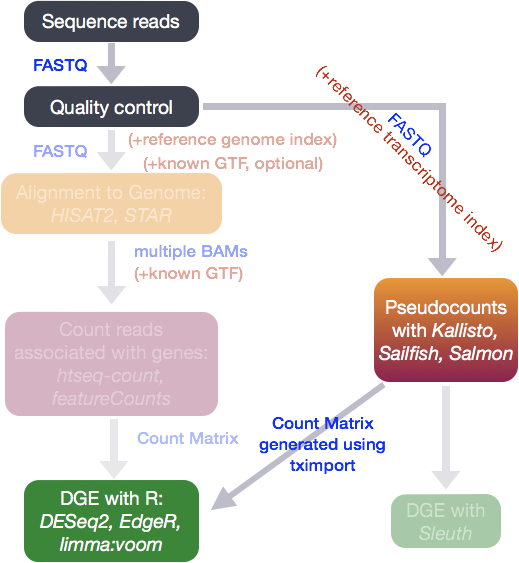
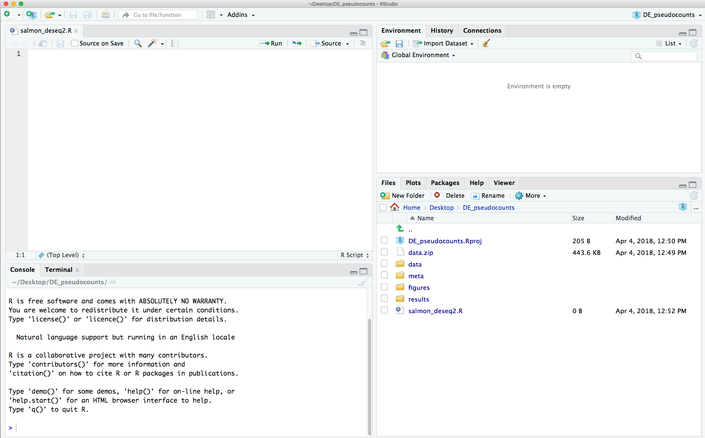
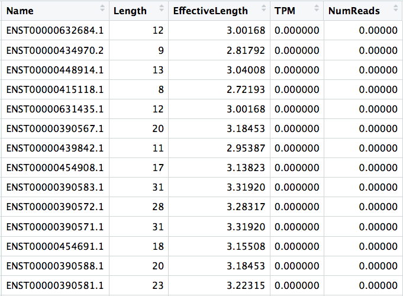

Approximate time: 30 minutes

## Learning Objectives

* Explore using pseudocounts from lightweight algorithms to perform gene-level differential expression analysis
* Understand different DESeq2 functions when working with pseudocounts


## Lightweight alignment and quantification of gene expression into pseudocounts

From the standard RNA-seq pipeline, we obtained a matrix of raw counts which represent the total number of reads that map to a gene in a particular sample. **Another strategy for quantification which has more recently been introduced involves transcriptome mapping**. Tools that fall in this category include [Kallisto](https://pachterlab.github.io/kallisto/about), [Sailfish](http://www.nature.com/nbt/journal/v32/n5/full/nbt.2862.html) and [Salmon](https://combine-lab.github.io/salmon/); each working slightly different from one another. (For this workshop we will explore Salmon pseudocounts in more detail.) Common to all of these tools is that **base-to-base alignment of the reads is avoided**, which is a time-consuming step, and these tools **provide quantification estimates much faster than do standard approaches** (typically more than 20 times faster) with **improvements in accuracy** at **the transcript level** [[2](http://salmon.readthedocs.io/en/latest/salmon.html#quasi-mapping-based-mode-including-lightweight-alignment)]. 

These transcript expression estimates, often referred to as **'pseudocounts'**, can be converted for use with DGE tools like DESeq2 or the estimates can be used directly for isoform-level differential expression using a tool like [Sleuth](http://www.biorxiv.org/content/biorxiv/early/2016/06/10/058164.full.pdf). 




### What is Salmon?

[Salmon](http://salmon.readthedocs.io/en/latest/salmon.html#using-salmon) is based on the philosophy of lightweight algorithms, which use the reference transcriptome (in FASTA format) and raw sequencing reads (in FASTQ format) as input, but do not align the full reads. These tools perform both mapping and quantification. Unlike most lightweight and standard alignment/quantification tools, **Salmon utilizes sample-specific bias models for transcriptome-wide abundance estimation**. Sample-specific bias models are helpful when needing to account for known biases present in RNA-Seq data including:

- GC bias
- positional coverage biases
- sequence biases at 5' and 3' ends of the fragments
- fragment length distribution
- strand-specific methods

If not accounted for, these biases can lead to unacceptable false positive rates in differential expression studies [[2](http://salmon.readthedocs.io/en/latest/salmon.html#quasi-mapping-based-mode-including-lightweight-alignment)]. The **Salmon algorithm can learn these sample-specific biases and account for them in the transcript abundance estimates**. Salmon is extremely fast at "mapping" reads to the transcriptome and often more accurate than standard approaches [[2](http://salmon.readthedocs.io/en/latest/salmon.html#quasi-mapping-based-mode-including-lightweight-alignment)]. 

> #### How does Salmon work?
> If you are interested in knowing more about the quasi-mapping approach underlying Salmon and how transcript abundance estimates are generated [take a look at our additional material](https://github.com/hbctraining/Intro-to-rnaseq-hpc-O2/blob/master/lessons/08_salmon.md#how-does-salmon-estimate-transcript-abundances).

## Performing DE analysis on Pseudocounts with DESeq2

The pseudocounts generated by Salmon are represented as normalized TPM (transcripts per million) counts and map to transcripts or genes, depending on the input in the index step; in our case it was transcripts. These **need to be converted into non-normalized count estimates for performing DESeq2 analysis**. To use DESeq2 we also need to be able to tell which transcript is associated with which gene and collapse our abundance estimates, to perform gene-level differential expression.


### Setting up the filesystem

Let's get started by setting up our directory. First let's copy over our metadata and the full Salmon output files. 

1. Create a new RStudio project by opening RStudio and selecting 'File' -> 'New Project'  -> 'New Directory', Call the project `DE_pseudocounts`.
2. Download the [Salmon files using this link](https://www.dropbox.com/s/sqeyxkbt4ij0j72/data.zip?dl=1) and move the zip archive (`data.zip`) into your working directory. _These are the full dataset Salmon files that contain transcript abundances for each sample._
3. Decompress (unzip) the zip archive by double-clicking on the file. You should now see a `data` folder in your working directory.
4. Create additional directories inside the project for `meta`, `results`, and `figures`.
5. Open up a new R script ('File' -> 'New File' -> 'Rscript'), and save it as `salmon_deseq2.R`

Your Rstudio interface should look something like the screenshot below:

<p align="center">
  
</p>

### Generating a pseudocount matrix 

The developers of DESeq2 have developed a package that can make the conversion of alignment-free methods of quantification compatible for DESeq2. This package is called [`tximport`](https://bioconductor.org/packages/release/bioc/html/tximport.html) and is available through Bioconductor. `tximport` imports transcript-level abundance, estimated counts and transcript lengths, and summarizes this into matrices for use with downstream gene-level analysis packages. 

**Step 1:** Load the required libraries:

```R
# Load libraries
library(tximport)
library(DESeq2)
library(annotables)
library(dplyr)
library(stringr)
```

**Step 2:** Load the file paths to the quantification data that was output from Salmon.

Inside each of the sample folders is a `quant.sf` file. This is the **quantification file** that was generated by Salmon in which each row corresponds to a transcript, listed by Ensembl ID, and the columns correspond to metrics for each transcript:



*  The first two columns are self-explanatory, the **name** of the transcript and the **length of the transcript** in base pairs (bp). 
*  The **effective length** represents the length of the transcript we can actually evaluate for abundance given various technical limitations of the sequencing platform.
* Salmon outputs ‘pseudocounts’ which predict the relative abundance of different isoforms in the form of three possible metrics (KPKM, RPKM, and TPM). **TPM (transcripts per million)** is a commonly used normalization method as described in [[1]](http://www.ncbi.nlm.nih.gov/pmc/articles/PMC2820677/) and is computed based on the effective length of the transcript.
* Estimated **number of reads** (an estimate of the number of reads drawn from this transcript given the transcript’s relative abundance and length)

```R
## List all directories containing data  
samples <- list.files(path = "./data", full.names = T, pattern="\\.salmon$")

## Obtain a vector of all filenames including the path
files <- file.path(samples, "quant.sf")

## Since all quant files have the same name it is useful to have names for each element
names(files) <-  str_replace(samples, "./data/", "")

 ```
    
> **OPTION 2: An alternative to this is having absolute paths instead of relative paths.** This would be useful so you can run this from anywhere in your filesystem.
>

```R
## DO NOT RUN
dir <- getwd()
files <- file.path(dir, "data", samples, "quant.sf")
	
## Create your own function
assignNames <- function(x){
		strsplit(x, "/")[[1]][9]
		}
names(files) <- sapply(files, assignNames, USE.NAMES=F)
```

Either of these methods will work, or even a combination of the two. The **main objective here is to add names to our quant files which will allow us to easily discriminate between samples in the final output matrix**. 

**Step 3.** Create a dataframe containing Ensembl Transcript IDs and Gene symbols

Our Salmon index was generated with transcript sequences listed by Ensembl IDs, but `tximport` needs to know **which genes these transcripts came from**, so we need to use the [`annotables`](https://github.com/stephenturner/annotables) package to extract this information. This package has basic annotation information from Ensembl Genes 91 for various organisms and is very helpful for mapping between different IDs. It also has `tx2gene` tables that link Ensembl gene IDs to Ensembl transcript IDs.

```r
# Look at the tx2gene table for GrCh37
grch37_tx2gene
```

Keep in mind that the Ensembl IDs listed in our Salmon output contained version numbers (i.e ENST00000632684.1). If we query `annotables` with those IDs it will not return anything. Therefore, do not forget to strip the version numbers from the Ensembl IDs as shown in the code below.


```r
# Create a character vector of Ensembl IDs		
ids <- read.delim(files[1], sep="\t", header=T)    # extract the transcript ids from one of the files
ids <- as.character(ids[,1])

# Strip the version numbers
ids.strip <- str_replace(ids, "([.][0-9][0-9])", "") # start with any double digit instances
ids.strip <- str_replace(ids.strip, "([.][0-9])", "") # now remove single digit instances
    
```

Now, we can subset the `tx2gene` table to keep only those rows that correspond to our IDs using the `filter()` function:

```r
tx2gene <- grch37_tx2gene %>%  
   filter(enstxp %in% ids.strip)
```
  
**Step 4:** Run tximport to summarize gene-level information    
```R
?tximport   # let's take a look at the arguments for the tximport function

txi <- tximport(files, type="salmon", txIn = TRUE, txOut = FALSE, tx2gene=tx2gene, ignoreTxVersion=TRUE)
```
### Output from `tximport`

The `txi` object is a simple list with three matrices: abundance, counts, length. 
```R
attributes(txi)
```
A final element 'countsFromAbundance' carries through the character argument used in the tximport call. The length matrix contains the average transcript length for each gene which can be used as an offset for gene-level analysis. 


### Using DESeq2 for DE analysis with pseudocounts

```R    

# Before we create this metadata object, let's see what the sample (column) order of the counts matrix is:
colnames(txi$counts)

## Create a sampletable/metadata
condition=factor(c(rep("Ctl",3), rep("KD", 2), rep("OE", 3)))
meta_salmon <- data.frame(condition, row.names = colnames(txi$counts))

# Change the rownames of the metadata to match our counts matrix
rownames(meta_salmon) <- colnames(txi$counts)

## Create a DESeqDataSet object
dds <- DESeqDataSetFromTximport(txi, meta_salmon, ~ sampletype)
```

Now you have created a DESeq object to proceed with DE analysis as we discussed in the earlier lessons!


***
*This lesson has been developed by members of the teaching team at the [Harvard Chan Bioinformatics Core (HBC)](http://bioinformatics.sph.harvard.edu/). These are open access materials distributed under the terms of the [Creative Commons Attribution license](https://creativecommons.org/licenses/by/4.0/) (CC BY 4.0), which permits unrestricted use, distribution, and reproduction in any medium, provided the original author and source are credited.*


