Approximate time: 1.5 hours

## Learning Objectives

* Determine differential expression of isoforms and visualization of results using Sleuth
* Understand how Sleuth determines biological and technical variation

## Transcript-level differential expression

Until this point we have focused on looking for expression changes at the gene-level. However, if you are interested in looking at **splice isoform expression changes between groups** the previous methods (i.e DESeq2) will not work. To demonstrate how to identify transcript-level differential expression we will be using a tool called Sleuth.


## What is Sleuth?

[Sleuth](http://pachterlab.github.io/sleuth/) is a fast, lightweight tool that uses transcript abundance estimates output from **pseudo-alignment** algorithms that use **bootstrap sampling**, such as Sailfish, Salmon, and Kallisto, to perform differential expression analysis of gene isoforms. 

To analyze the differential expression of gene isoforms, it is expected that RNA-Seq reads will often align to multiple isoforms of the same gene. Therefore, **multimapping reads cannot be ignored** to properly determine abundances of gene isoforms. 

Due to the statistical procedure required to assign reads to gene isoforms, in addition to the random processes underlying RNA-Seq, there will be **technical variability in the abundance estimates** output from the pseudo-alignment tool [[2](https://rawgit.com/pachterlab/sleuth/master/inst/doc/intro.html), [3](https://www.nature.com/articles/nmeth.4324)]. Therefore, **we would need technical replicates to distinguish technical variability from the biological variability**.

Sleuth accounts for this technical variability by using **bootstraps as a proxy for technical replicates**, which are used to model the technical variability in the abundance estimates. Bootstrapping essentially **calculates the abundance estimates for all genes using a different sub-sample of reads** during each round of bootstrapping. The variation in the abundance estimates output from each round of bootstrapping is used for the estimation of the technical variance for each gene. 

<p align="center">
  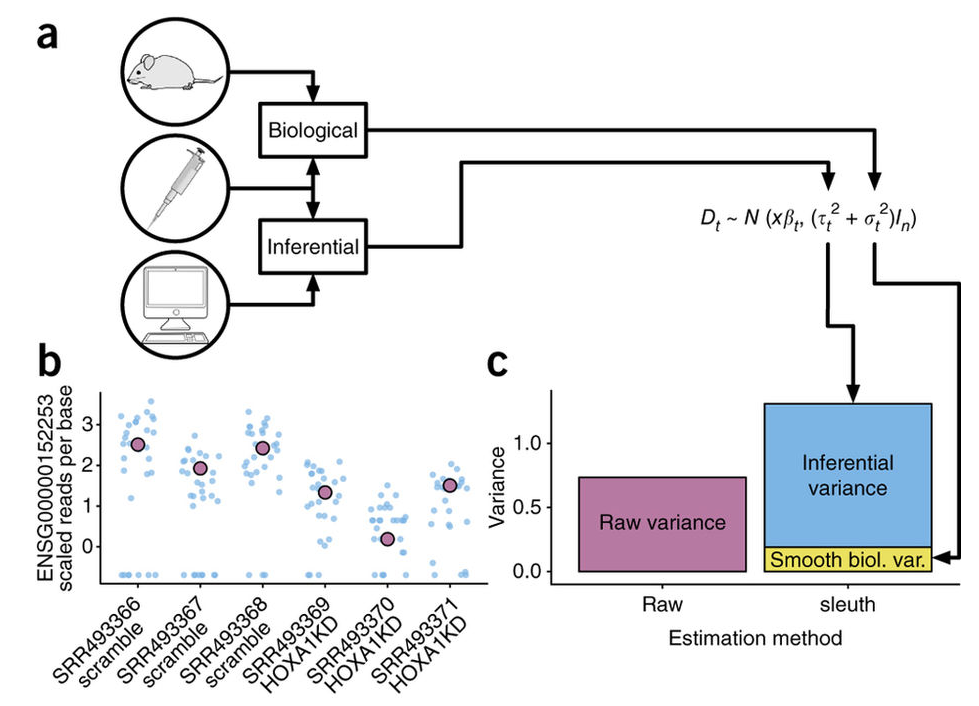
</p>

_Adapted from: Nature Methods **14**, 687–690 (2017)_

Sleuth models the unobserved true abundance (logarithm of true counts) using a general linear model, but includes the technical variance (variance between bootstrapping runs) as error in the response variable. 

<p align="center">
  
</p>


The observed (log) abundance estimates represent the sum of the true counts and the technical noise. Thereby, sleuth teases apart the source of the variance (technical vs. biological) for estimation of the "true" biological variance when determining whether transcripts are differentially expressed.

<p align="center">
  
</p>

In addition to performing differential expression analysis of transcripts, the sleuth tool also provides an html interface allowing exploration of the data and differential expression results interactively. More information about the theory/process for sleuth is available in the [Nature Methods paper](https://www.nature.com/articles/nmeth.4324), this [blogpost](https://liorpachter.wordpress.com/2015/08/17/a-sleuth-for-rna-seq/) and step-by-step tutorials are available on the [sleuth website](https://pachterlab.github.io/sleuth/walkthroughs).

***NOTE:*** *Kallisto is distributed under a non-commercial license, while Sailfish and Salmon are distributed under the [GNU General Public License, version 3](http://www.gnu.org/licenses/gpl.html).*


## Set-up for Running Sleuth

Sleuth is a lightweight algorithm that can be quickly run on our personal computers. We can open the `DE_pseudocounts` project we created previously, since we will be using the salmon output files.

1. Open the RStudio project entitled `DE_pseudocounts`.
2. Create a new R script ('File' -> 'New File' -> 'Rscript'), and save it as `sleuth_de.R`

To perform any analysis, we need to load the libraries for `wasabi` and `sleuth`. Sleuth also requires `annotables`, so this package will be loaded as well:

```R
library(wasabi)
library(sleuth)
library(annotables)
library(tidyverse)
```

## Using Wasabi to convert Salmon output for Sleuth

Sleuth was built to use the bootstrapped estimates of transcript abundance from Kallisto; however, abundance estimates from Salmon (or Sailfish) work just as well, as long as bootstrapping is performed. To use our Salmon output estimates, we need to convert them to a Sleuth-compatible format using the Wasabi package.

First, we create a simple vector containing the paths to the directories containing the transcript abundance estimates for each sample (folders containing the .quant files). We can use the `file.path()` function to give the paths to each of the directories. 

Now, let's use this function to create our list of the paths to our transcript abundance files:

```R
sf_dirs <- file.path("data", c("Mov10_kd_2.salmon", "Mov10_kd_3.salmon", "Mov10_oe_1.salmon", "Mov10_oe_2.salmon", "Mov10_oe_3.salmon","Irrel_kd_1.salmon", "Irrel_kd_2.salmon", "Irrel_kd_3.salmon"))

sf_dirs
```

Now, we simply run the `prepare_fish_for_sleuth` function, which will write some status messages to the console and, when it's done, each directory will contain an `abundance.h5` file in a sleuth-compatible format.

```R
prepare_fish_for_sleuth(sf_dirs)
```

Each of the sample directories should now contain the `abundance.h5` files. These 
files will be used as input to Sleuth.

<p align="center">
  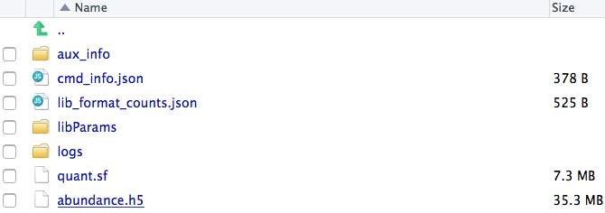
</p>

## Sleuth for estimation of differential expression of transcripts

<p align="center">
  
</p>

The workflow for Sleuth is similar to the workflow followed for DESeq2, even though, the models for estimating differential expression are very different. 

**Step 1:** Creation of Sleuth object to provide metadata, estimated counts, and design formula for the analysis, in addition to a `annotables` database to switch between transcript IDs and associated gene names.

**Step 2:** Fit the sleuth model
	
- Estimation of size (normalization) factors using the median of ratios method (similar to DESeq2)
	
- Normalization of estimated counts using size factors (est. counts / size factors - similar to DESeq2)

- Filtering of low abundance transcripts (< 5 est counts in more than 47% of the samples)

- Normalization of technical variation estimates

- Estimation of biological variance and shrinkage estimates (With small sample sizes, we will make very bad estimates of transcript-wise dispersion unless we share information across transcripts. Sleuth regularizes the biological variance estimate with shrinkage, similar to DESeq2, except uses a different statistical method (similar to Limma Voom).)
	
- Parameter estimation and estimation of variance using the general linear model.

- Identification of:
	- **Coefficients:** indicating overall expression strength
	- **Beta values:** estimates of fold changes	

**Step 3:** Test for significant differences between conditions

After performing all analysis steps, we will explore the sample QC plots and plotting of results. In addition, we will use the html interface available through the sleuth package.

## Sleuth workflow

### Step 1: Create Sleuth object for analysis

<p align="center">

</p>

Similar to DESeq2, we need to tell Sleuth where to find the **metadata** (specifying which samplegroups the samples belong to, and any other metadata we want included in the analysis), **estimated counts** (output from Salmon) and the **design formula**. In addition, we also need a **annotables** to easily convert between transcript IDs and associated gene names. To create this object there is no simple function like in DESeq2 (e.g. DESeqDataSetFromMatrix(countData = data, colData = meta, design = ~ sampletype)). 

To create this Sleuth object, we need to perform the following steps:

1. Create a dataframe containing metadata and locations of the estimated counts files:

  	- including any columns containing metadata to used in the analysis
  	- a column named `sample` containing all of the sample names matching the names in the metadata file
  	- a column named `path` containing the path to the abundance estimate files output from `wasabi`
        
2. Create a variable containing the model design 

3. Use annotables to create a dataset for Sleuth to query for Ensembl IDs and associated gene names

#### Create a dataframe needed to generate Sleuth analysis object

First we need to bring in the metadata file:

- Download the **metadata** associated with the Salmon files by **right-clicking [this link](https://github.com/hbctraining/DGE_workshop/raw/master/data/Mov10_full_meta.txt)** and selecting `Download Linked File` or `Save Linked File As` and saving to the `meta` directory.

- Read in the metadata file and use the `data.frame()` function to ensure it is a dataframe, then combine the metadata with the paths to the transcript abundance files to use as input for the Sleuth analysis. 

```r
# Read in metadata file

summarydata <- data.frame(read.table("meta/Mov10_full_meta.txt", header=TRUE, row.names=1), check.rows=FALSE)

summarydata
```

Then we make sure the metadata and count estimate sample names match:

```r
# Make sure the order of the `sfdirs` created above matches the order of samples in the `summarydata` rownames

sf_dirs_samples <- sf_dirs %>%
  basename() %>% 
  str_replace(pattern = "\\.salmon", "")

all(sf_dirs_samples == rownames(summarydata))
```
Now, we can name the vector of directory paths with the corresponding sample names

```r
# Name the directory paths for the abundance files with their corresponding sample IDs

names(sf_dirs) <- rownames(summarydata)

sf_dirs
```

Finally, we can generate the data frame containing the metadata:

```r
# Generate the dataframe

sfdata <- summarydata
```

Sleuth expects the data to be presented in a specific format with specific column and row names; therefore, we will need to name columns based on the sleuth requirements for the analysis. 

Sleuth requires a column entitled "sample" containing the sample names:

```r
# Adding a column named 'sample'

sfdata$sample <- rownames(sfdata)
```

Now, we can include the path to the count estimate folders. Sleuth requires a column entitled "path" containing the paths to the estimated counts files stored in our `sf_dirs`:

```r
sfdata$path <- sf_dirs

sfdata
```

#### Provide the model design

Now that we have the metadata and location of the count estimates, we can input our design formula to determine the covariates and/or confounders that should be included in your experimental design model. Sleuth can be used to analyze multiple conditions from complex experimental designs.

Within Sleuth, models are written similar to DESeq2. Since the only condition we plan to test is our sample type, our design formula is very simple:

```r
design <- ~ sampletype
```

More complex designs can be analyzed using Sleuth as well by adding additional covariates (i.e `design <- ~ sex + treatment`). Interaction terms can also be added to the design formula to test if the effect attributable to a given condition is different based on another factor, for example, if the treatment effect differs between sexes. To learn more about setting up design formulas for more complex designs, the [DESeq2 vignette](http://bioconductor.org/packages/devel/bioc/vignettes/DESeq2/inst/doc/DESeq2.html) has detailed documentation that should work for sleuth too. 

In addition, [one of the sleuth walk-throughs](https://pachterlab.github.io/sleuth_walkthroughs/trapnell/analysis.html) describes in detail how to perform the LRT test with specification of the full and reduced models.

#### Query annotables dataset to obtain the corresponding Ensembl transcript/gene IDs

The last component to include for our analysis is the annotables Ensembl genome dataset to obtain the Ensembl transcript/gene IDs and gene names for annotation of results. There are conversion objects available to us by just loading the annotables library:

```r
grch37 %>% head()

grch37_tx2gene %>% head()
```

We can use the `grch37_tx2gene` dataset for our conversion purposes:

```r
# Using annotables

t2g <- grch37_tx2gene

t2g <- merge(x= grch37[, c("symbol", "ensgene")], y = t2g, by.x="ensgene", by.y= "ensgene")

## Rename the columns for use in Sleuth

t2g <- dplyr::rename(t2g, target_id = enstxp , 
                     ens_gene = ensgene, 
                     ext_gene = symbol)
```

### Step 2: Fit the sleuth model

<p align="center">
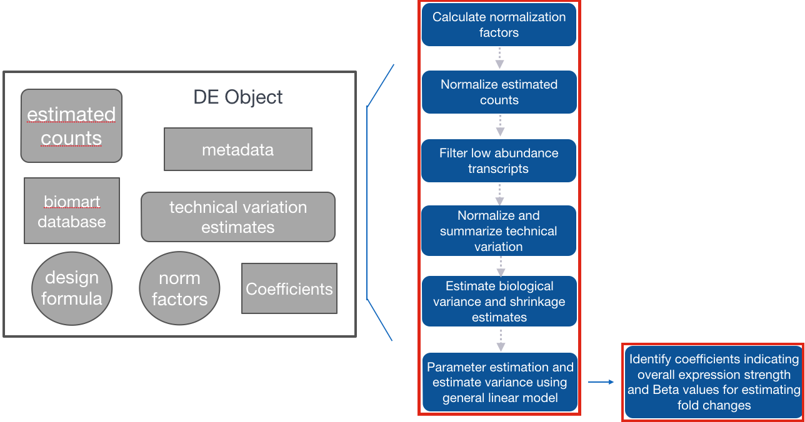
</p>

#### Fit the transcript abundance data to the Sleuth model

Using the `sleuth_prep()` function, the counts are normalized and filtered, then merged with the metadata. In addition, the bootstraps for each transcript are summarized. This function can take a bit of time, but there is an option (`ncores`) to split across multiple processors.

```r
# Create sleuth object for analysis 

so <- sleuth_prep(sfdata, 
                  full_model = design, 
                  target_mapping = t2g, 
                  read_bootstrap_tpm = TRUE,
                  extra_bootstrap_summary = TRUE,
                  transformation_function = function(x) log2(x + 0.5))  
```

>**NOTE:** By default the transformation of counts is natural log, which would make the output fold changes somewhat more difficult to interpret. By specifying the `transformation_function` to be `log2(x + 0.5)` we are ensuring our output fold changes are log2.

In fitting the sleuth model, sleuth performs shrinkage of variance, parameter estimation and estimation of variance using the general linear model:

```r
so <- sleuth_fit(so)
```

> **NOTE:** alternatively the two prior steps could have been run as: 
> ```r
> so <- sleuth_prep(sfdata, 
>                  full_model = design, 
>                  target_mapping = t2g, 
>                  read_bootstrap_tpm = TRUE,
>                  extra_bootstrap_summary = TRUE,
>                  transformation_function = function(x) log2(x + 0.5)) %>%
>	sleuth_fit()
> ```

#### Check which models have been fit and which coefficients can be tested

Ensure the design model and coefficients are correct for your analysis. The level not shown is the base level.

```r
models(so)
```

> **NOTE:** Sleuth will automatically use the first level (alphabetically by default) in the factor variable being tested to compare all other conditions against (in our metadata, this is 'control'). If you want to use a different condition to be the base level, then you would need to use the relevel() function to change the base level of the variable in step 1 above. For example, if we wanted the base level of `sampletype` to be "MOV10_knockdown", we could use the following code:
>
>```r
> # DO NOT RUN!
> summarydata$sampletype <- relevel(summarydata$sampletype, ref = "MOV10_knockdown")
>```
>***An ordered factor will not give interpretable output, so do NOT order the factor using the factor() function with `ordered = TRUE`, use factor() specifying the levels or relevel() instead.***

### Step 3: Test significant differences between conditions using the Wald test

At this step in the workflow, we need to specify which level we want to compare against the base level (use the name given for the coefficients from `models(so)`):

```r
# Wald test for differential expression of isoforms

oe <- sleuth_wt(so, 
                which_beta = 'sampletypeMOV10_overexpression')

# output results

sleuth_results_oe <- sleuth_results(oe, 
                                    test = 'sampletypeMOV10_overexpression', 
                                    show_all = TRUE)
```

>**NOTE:** 

The output represents the results from the differential expression testing with the following columns:

- **`target_id`:** the Ensembl transcript ID
- **`pval`:** the Wald test FDR adjusted pvalue using Benjamini-Hochberg
- **`qval`:** the p-value adjusted for multiple test correction
- **`b`:** beta value, which is the log2 fold changes between conditions (These are log2 b/c we specified log2 transformation in the `sleuth_prep()` step. By default, these would have been natural log fold changes).
- **`se_b`:** standard error of the beta value
- **`mean_obs`:** the mean expression (log2) of the transcript across all samples
- **`var_obs`:** the biological variance of the expression
- **`tech_var`:** the technical variance of expression (derived from the bootstraps)
- **`sigma_sq`:** raw estimator of the variance once the technical variance has been removed
- **`smooth_sigma_sq`:** the smooth regression fit for the shrinkage estimation
- **`final_sigma_sq`:** max(sigma_sq, smooth_sigma_sq). this is the one used for covariance estimation of beta (in addition to tech_var)
- **`ens_gene`:** associated Ensembl gene ID
- **`ext_gene`:** associated gene symbol

* Adapted from the results table description in Harold Pimental's [post](https://groups.google.com/forum/#!searchin/kallisto-sleuth-users/mean_obs%7Csort:date/kallisto-sleuth-users/kWodd7CQejE/nzr6hEOKAAAJ) to the 'kallisto-sleuth-users' google groups. Harold Pimental is an author of sleuth.*


### Exploring transcript-level expression between samples

#### Exploratory analyses:

Now that we have our results, we can perform some exploratory analyses, such as PCA, heatmap, and distributions of counts between conditions. By default, these plots will use the sleuth-normalized `est_counts` (not the log2 transformed values).

**PCA:** There are multiple functions to explore the variation in the dataset explained by the different PCs.

```r
plot_pca(oe, 
         color_by = 'sampletype',
         text_labels = TRUE)
```

<p align="center">
  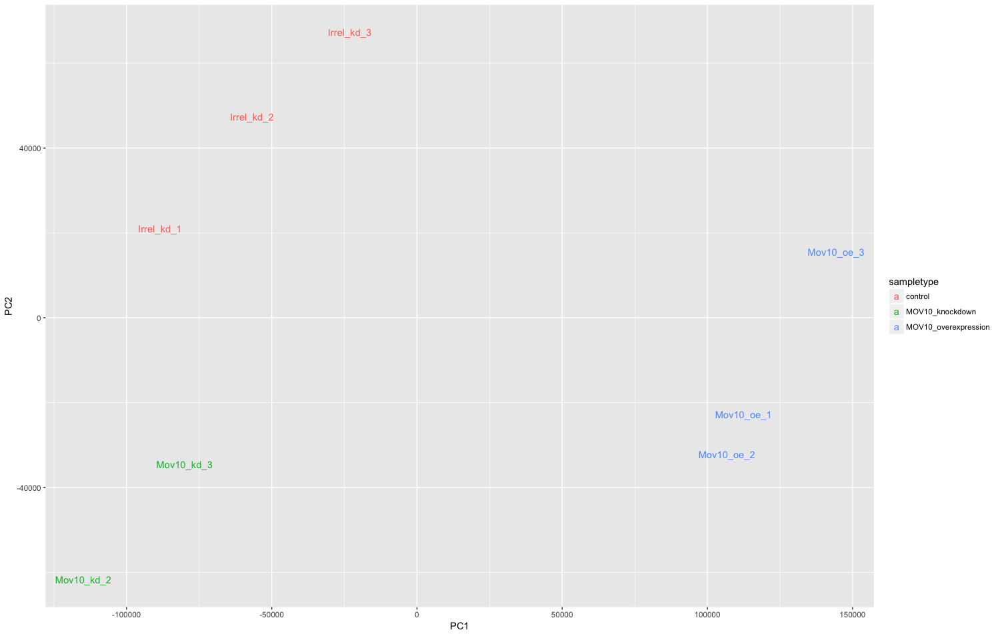
</p>

```r
plot_pc_variance(oe)
```

<p align="center">
  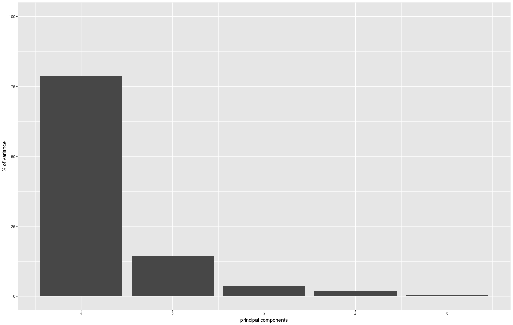
</p>

```r
plot_loadings(oe)
```

<p align="center">
  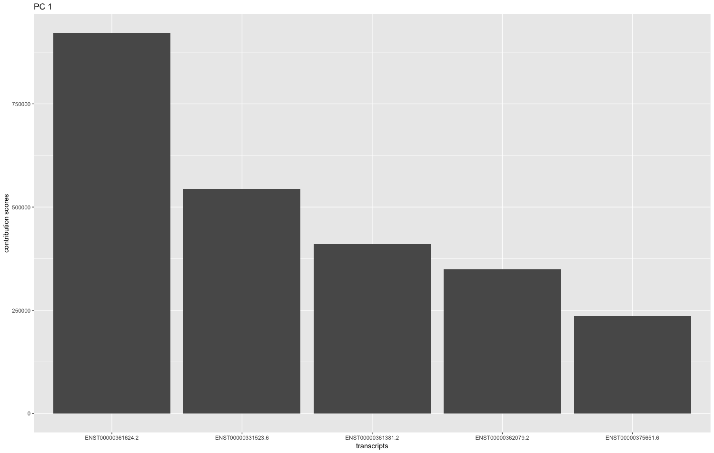
</p>

**Heatmap:** The heatmap plot is shaded with the Jensen-Shannon divergence values. Therefore, **lower divergence values represent samples that are more similar to each other**.

```r
plot_sample_heatmap(oe)
```

<p align="center">
  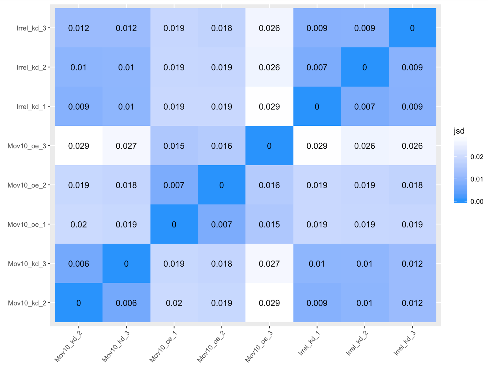
</p>

**Count distributions:** There is a histogram plot to explore count distributions between sample groups, which should be similar to each other when performing DE testing. The count distributions represent the proportion of genes (on the y-axis) associated with the number of counts (designated on the x-axis):

```r
plot_group_density(oe, 
                   use_filtered = FALSE, 
                   units = "est_counts",
                   trans = "log", 
                   grouping = "sampletype")
```

<p align="center">
  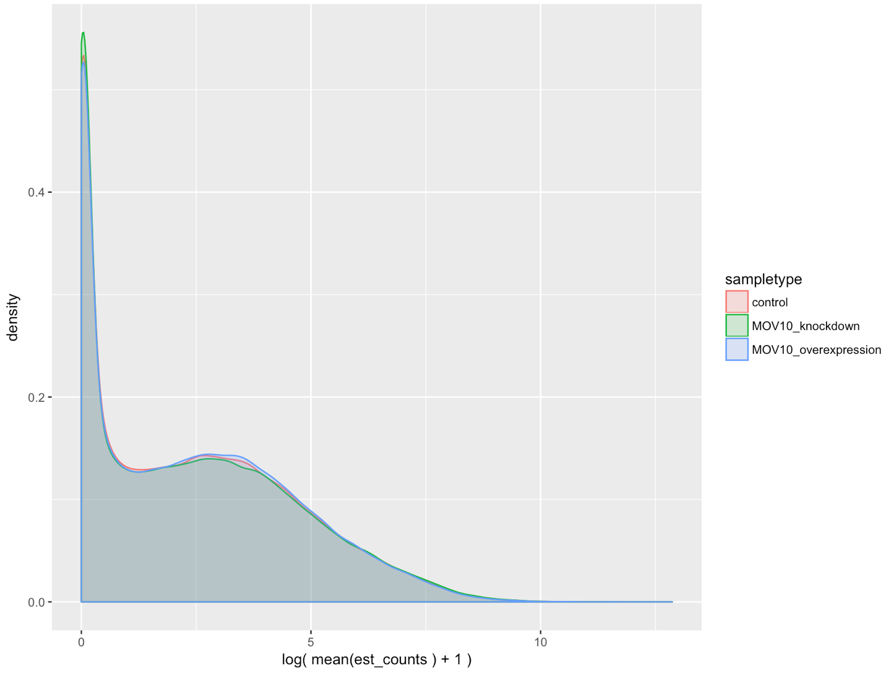
</p>

As we know, most genes have few counts, but we filter these genes prior to performing DE analysis. If we want to look at the distributions of the filtered genes used for DE analysis, we could change the `use_filtered` argument to `TRUE`.

```r
plot_group_density(oe, 
                   use_filtered = TRUE, 
                   units = "est_counts",
                   trans = "log", 
                   grouping = "sampletype")
```

<p align="center">
  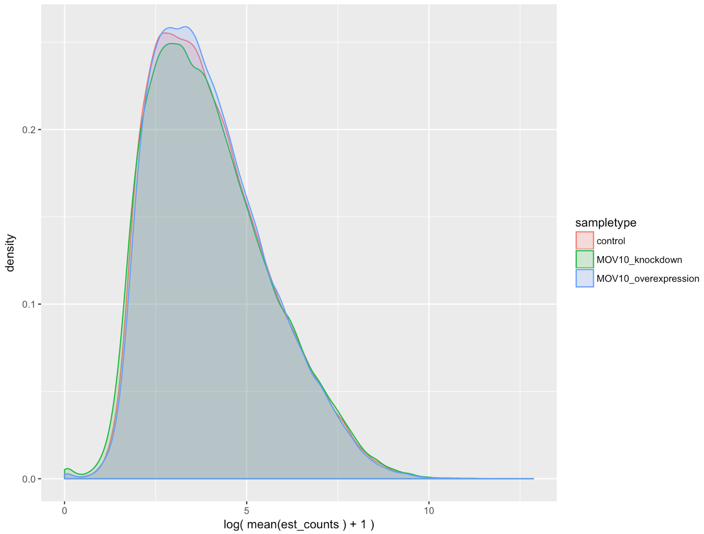
</p>

#### Results analyses: 

There are also functions to explore the results, such as the MA plot:

```r
# Try the plot_ma() function
plot_ma(oe) # shows that we need to specify the 'test'

?plot_ma

# Check for possible tests
tests(oe)

# Try the plot_ma() function again
plot_ma(oe, 
        test="sampletypeMOV10_overexpression", 
        sig_level = 0.05)
```

<p align="center">
  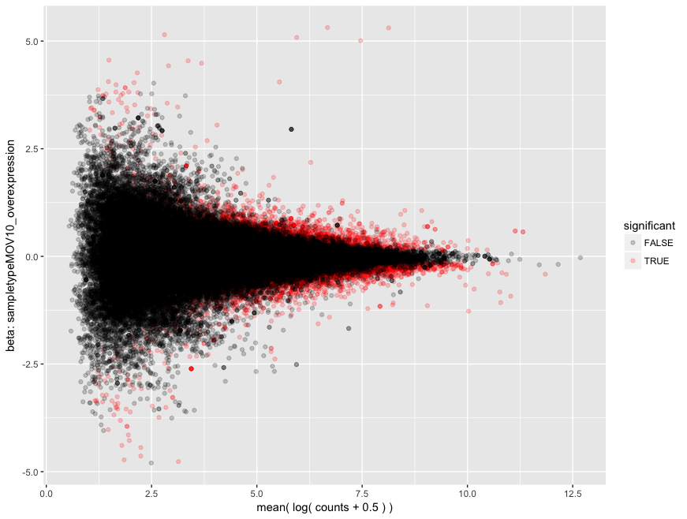
</p>

Also, we can perform an expression heatmap for select transcripts:

```r
sig_transcripts <- sleuth_results_oe %>% 
  filter(qval < 0.05)
  
plot_transcript_heatmap(oe, 
                        transcripts = sig_transcripts$target_id[1:20])
```

<p align="center">
  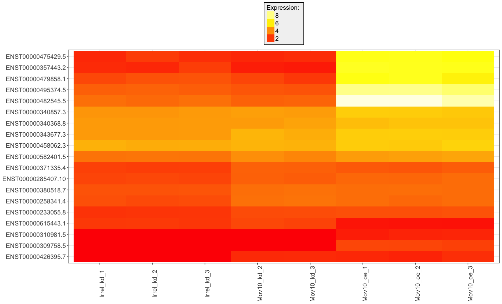
</p>

Sleuth also has some handy functions to plot expression of transcripts with bootstrap variation to **visualize both biological and technical variation** for selected transcripts:

```r
# Plotting

plot_bootstrap(oe, 
               target_id = "ENST00000495374.5", 
               units = "est_counts", 
               color_by = "sampletype")

plot_bootstrap(oe, 
               target_id = "ENST00000367412.1", 
               units = "est_counts", 
               color_by = "sampletype")
```

<p align="center">
  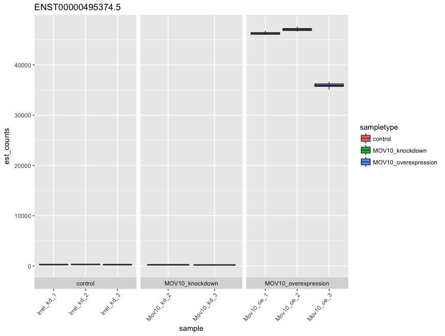
</p>

<p align="center">
  
</p>

Sleuth also offers us the option to explore the data and results interactively using a web interface. 

```r
sleuth_live(oe)
```

Using this web interface, we can explore diagnostic plots and summaries of experimental factors and expression levels. We also have the ability to perform clustering analyses such as PCA and heatmaps. Finally, we can analyze the differential expression results by plotting MA and volcano plots and by exploring expression levels at the transcript and gene levels. A brief tutorial explaining the options available interactively can be found [here](http://www.rna-seqblog.com/iihg-intro-to-sleuth-for-rna-seq/).

Explore the results table under the `analyses` tab, `test table`.


Look at the expression levels of Mov10 for three different isoforms using the `analyses` tab, `gene view`. Look for the Mov10 gene, ENSG00000155363. Compare expression of the different isoforms of Mov10.

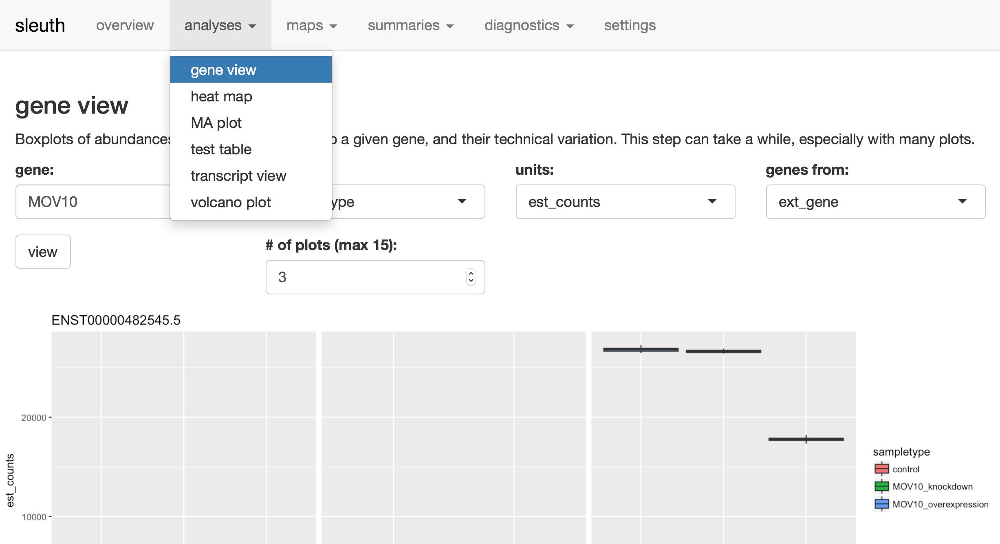

***
*This lesson has been developed by members of the teaching team at the [Harvard Chan Bioinformatics Core (HBC)](http://bioinformatics.sph.harvard.edu/). These are open access materials distributed under the terms of the [Creative Commons Attribution license](https://creativecommons.org/licenses/by/4.0/) (CC BY 4.0), which permits unrestricted use, distribution, and reproduction in any medium, provided the original author and source are credited.*
