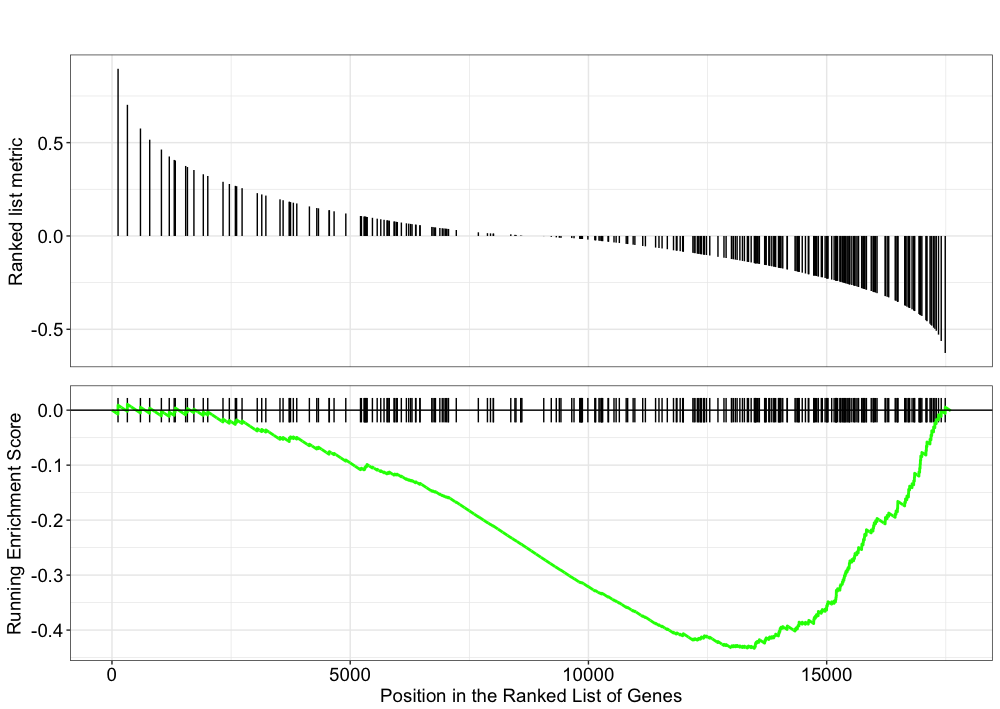

Approximate time: 120 minutes

Learning Objectives:
-------------------

*  Determine how functions are attributed to genes using Gene Ontology terms
*  Understand the theory of how functional enrichment tools yield statistically enriched functions or interactions
*  Discuss functional analysis using over-representation analysis, functional class scoring, and pathway topology methods
*  Explore functional analysis tools

# Functional analysis 

The output of RNA-seq differential expression analysis is a list of significant differentially expressed genes (DEGs). To gain greater biological insight on the differentially expressed genes there are various analyses that can be done:

- determine whether there is enrichment of known biological functions, interactions, or pathways
- identify genes' involvement in novel pathways or networks by grouping genes together based on similar trends
- use global changes in gene expression by visualizing all genes being significantly up- or down-regulated in the context of external interaction data

Generally for any differential expression analysis, it is useful to interpret the resulting gene lists using freely available web- and R-based tools.  While tools for functional analysis span a wide variety of techniques, they can loosely be categorized into three main types: over-representation analysis, functional class scoring, and pathway topology [[1](https://github.com/hbctraining/In-depth-NGS-Data-Analysis-Course/raw/master/resources/pathway_tools.pdf)]. 


The goal of functional analysis is provide biological insight, so it's necessary to analyze our results in the context of our experimental hypothesis: **FMRP and MOV10 associate and regulate the translation of a subset of RNAs**. Therefore, based on the authors' hypothesis, we may expect the enrichment of processes/pathways related to **translation, splicing, and the regulation of mRNAs**, which we would need to validate experimentally.

***Note that all tools described below are great tools to validate experimental results and to make hypotheses. These tools suggest genes/pathways that may be involved with your condition of interest; however, you should NOT use these tools to make conclusions about the pathways involved in your experimental process. You will need to perform experimental validation of any suggested pathways.***

## Over-representation analysis
There are a plethora of functional enrichment tools that perform some type of over-representation analysis by querying databases containing information about gene function and interactions. **Querying these databases for gene function requires the use of a _consistent vocabulary_ to describe gene function.** One of the most widely-used vocabularies is the **Gene Ontology (GO)**. This vocabulary was established by the Gene Ontology project, and the words in the vocabulary are referred to as GO terms. 

### Gene Ontology project

"The Gene Ontology project is a collaborative effort to address the need for consistent descriptions of gene products across databases" [[2](http://geneontology.org/page/introduction-go-resource)]. The [Gene Ontology Consortium](http://geneontology.org/page/go-consortium-contributors-list) maintains the GO terms, and these GO terms are incorporated into gene annotations in many of the popular repositories for animal, plant, and microbial genomes. 

Tools that investigate **enrichment of biological functions or interactions** can query these databases for GO terms associated with a list of genes to determine whether any GO terms associated with particular functions or interactions are enriched in the gene set. Therefore, to best use and interpret the results from these functional analysis tools, it is helpful to have a good understanding of the GO terms themselves.

### GO terms

#### GO Ontologies

To describe the roles of genes and gene products, GO terms are organized into three independent controlled vocabularies (ontologies) in a species-independent manner: 

- **Biological process:** refers to the biological role involving the gene or gene product, and could include "transcription", "signal transduction", and "apoptosis". A biological process generally involves a chemical or physical change of the starting material or input.
- **Molecular function:** represents the biochemical activity of the gene product, such activities could include "ligand", "GTPase", and "transporter". 
- **Cellular component:** refers to the location in the cell of the gene product. Cellular components could include "nucleus", "lysosome", and "plasma membrane".

Each GO term has a term name (e.g. **DNA repair**) and a unique term accession number (**GO:0005125**), and a single gene product can be associated with many GO terms, since a single gene product "may function in several processes, contain domains that carry out diverse molecular functions, and participate in multiple alternative interactions with other proteins, organelles or locations in the cell" [[3](https://github.com/hbctraining/In-depth-NGS-Data-Analysis-Course/raw/master/resources/go_terms.pdf)]. 

#### GO term hierarchy

Some gene products are well-researched, with vast quantities of data available regarding their biological processes and functions. However, other gene products have very little data available about their roles in the cell. 

For example, the protein, "p53", would contain a wealth of information on it's roles in the cell, whereas another protein might only be known as a "membrane-bound protein" with no other information available. 

The GO ontologies were developed to describe and query biological knowledge with differing levels of information available. To do this, GO ontologies are loosely hierarchical, ranging from general, 'parent', terms to more specific, 'child' terms. The GO ontologies are "loosely" hierarchical since 'child' terms can have multiple 'parent' terms.

Some genes with less information may only be associated with general 'parent' terms or no terms at all, while other genes with a lot of information be associated with many terms.


[Tips for working with GO terms](http://journals.plos.org/ploscompbiol/article?id=10.1371/journal.pcbi.1003343)

### Hypergeometric testing

In a set of genes, the frequency of GO terms can be determined, and the comparison of frequencies between a gene list & a “background” set will inform us about the over- or under-representation of the GO terms. This type of testing can inform us about over- or under-representation of other entities such as *particular motifs or pathways* too.


To determine whether GO terms (or motifs and pathways) are over- or under-represented, you can determine the **probability of having the observed proportion of genes associated with a specific GO term in your gene list based on the proportion of genes associated with the same GO term in the background set**. The background dataset can be all genes in genome for your organism or you can select your own background to use.

For example, let's suppose there are 13,000 total genes in the honeybee genome and 85 genes are associated with the GO term "DNA repair". In your gene list, there are 50 genes associated with "DNA repair" out of 1,000 genes in gene list. 

By comparing the ratios, 85/13,000 in "background" dataset and 50/1,000 in your gene list, it's evident that the GO term "DNA repair" is over-represented in your dataset.

To determine whether a GO term or pathway is *significantly* over- or under-represented, tools often perform **hypergeometric testing**. Using our honeybee example, the hypergeometric distribution is a probability distribution that describes the probability of 50 genes (k) being associated with "DNA repair", for all genes in our gene list (n=1,000), from a population of all of the genes in entire genome (N=13,000) which contains 85 genes (K) associated with "DNA repair" [[4](https://en.wikipedia.org/wiki/Hypergeometric_distribution)].

The calculation of probability of k successes follows the formula:

 

## clusterProfiler

We will be using [clusterProfiler](http://bioconductor.org/packages/release/bioc/html/clusterProfiler.html) to perform over-representation analysis on GO terms associated with our list of significant genes. The tool takes as input a significant gene list and a background gene list and performs statistical enrichment analysis using hypergeometric testing. The basic arguments allow the user to select the appropriate organism and GO ontology (BP, CC, MF) to test. 

### Running clusterProfiler

To run clusterProfiler GO over-representation analysis, we will change our gene names into Ensembl IDs, since the tool works a bit easier with the Ensembl IDs. 

Let's open up our previous **`DEanalysis` project**, and create a **`functional_analysis.R` script**.

Then load the following libraries:

```r
library(org.Hs.eg.db)
library(DOSE)
library(pathview)
library(purrr)
library(clusterProfiler)
library(annotables)
```

For the different steps in the functional analysis, we require Ensembl and Entrez IDs. To convert the gene symbols to these IDs, we will use the **annotables** package and merge the IDs with the DE results. 

```r
## Explore the grch37 table loaded by the annotables library
grch37

## Return the IDs for the gene symbols in the DE results
idx <- grch37$symbol %in% rownames(res_tableOE)

ids <- grch37[idx, ]

## The gene names can map to more than one Ensembl ID (some genes change ID over time), 
## so we need to remove duplicate IDs prior to assessing enriched GO terms
non_duplicates <- which(duplicated(ids$symbol) == FALSE)

ids <- ids[non_duplicates, ] 

## Merge the IDs with the results 
res_ids <- inner_join(res_tableOE_tb, ids, by=c("gene"="symbol"))         
```

To perform the over-representation analysis, we need a list of background genes and a list of significant genes. For our background dataset we will use all genes tested for differential expression (all genes in our results table). For our significant gene list we will use genes with p-adjusted values less than 0.05 (we could include a fold change threshold too if we have many DE genes).

```r
## Create background dataset for hypergeometric testing using all genes tested for significance in the results                 
allOE_genes <- as.character(res_ids$ensgene)

## Extract significant results
sigOE <- filter(res_ids, padj < 0.05)

sigOE_genes <- as.character(sigOE$ensgene)
```

Now we can perform the GO enrichment analysis and save the results:

```r
## Run GO enrichment analysis 
ego <- enrichGO(gene = sigOE_genes, 
                universe = allOE_genes,
                keyType = "ENSEMBL",
                OrgDb = org.Hs.eg.db, 
                ont = "BP", 
                pAdjustMethod = "BH", 
                qvalueCutoff = 0.05, 
                readable = TRUE)
                
## Output results from GO analysis to a table
cluster_summary <- data.frame(ego)

write.csv(cluster_summary, "results/clusterProfiler_Mov10oe.csv")
```
>**NOTE:** The different organisms with annotation databases available to use with clusterProfiler can be found [here](../img/orgdb_annotation_databases.png)
> Also, the `keyType` argument may be coded as `keytype` in different versions of clusterProfiler.

                

### Visualizing clusterProfiler results
clusterProfiler has a variety of options for viewing the over-represented GO terms. We will explore the dotplot, enrichment plot, and the category netplot.

The **dotplot** shows the number of genes associated with the first 50 terms (size) and the p-adjusted values for these terms (color). This plot displays the top 50 genes by gene ratio (# genes related to GO term / total number of sig genes), not p-adjusted value.

```r
## Dotplot 
dotplot(ego, showCategory=50)
```

**To save the figure,** click on the `Export` button in the RStudio `Plots` tab and `Save as PDF...`. In the pop-up window, change:
- `Orientation:` to `Landscape`
- `PDF size` to `8 x 14` to give a figure of appropriate size for the text labels


The next plot is the **enrichment GO plot**, which shows the relationship between the top 50 most significantly enriched GO terms (padj.), by grouping similar terms together. The color represents the p-values relative to the other displayed terms (brighter red is more significant) and the size of the terms represents the number of genes that are significant from our list.

```r
## Enrichmap clusters the 50 most significant (by padj) GO terms to visualize relationships between terms
enrichMap(ego, n=50, vertex.label.font=6)
```

**To save the figure,** click on the `Export` button in the RStudio `Plots` tab and `Save as PDF...`. In the pop-up window, change the `PDF size` to `24 x 32` to give a figure of appropriate size for the text labels.


Finally, the **category netplot** shows the relationships between the genes associated with the top five most significant GO terms and the fold changes of the significant genes associated with these terms (color). The size of the GO terms reflects the pvalues of the terms, with the more significant terms being larger. This plot is particularly useful for hypothesis generation in identifying genes that may be important to several of the most affected processes. 

```r
## To color genes by log2 fold changes, we need to extract the log2 fold changes from our results table creating a named vector
OE_foldchanges <- sigOE$log2FoldChange

names(OE_foldchanges) <- sigOE$gene

## Cnetplot details the genes associated with one or more terms - by default gives the top 5 significant terms (by padj)
cnetplot(ego, 
         categorySize="pvalue", 
         showCategory = 5, 
         foldChange=OE_foldchanges, 
         vertex.label.font=6)
         
## If some of the high fold changes are getting drowned out due to a large range, you could set a maximum fold change value
OE_foldchanges <- ifelse(OE_foldchanges > 2, 2, OE_foldchanges)
OE_foldchanges <- ifelse(OE_foldchanges < -2, -2, OE_foldchanges)

cnetplot(ego, 
         categorySize="pvalue", 
         showCategory = 5, 
         foldChange=OE_foldchanges, 
         vertex.label.font=6)
```

**Again, to save the figure,** click on the `Export` button in the RStudio `Plots` tab and `Save as PDF...`. Change the `PDF size` to `48 x 56` to give a figure of appropriate size for the text labels.


If you are interested in significant processes that are **not** among the top five, you can subset your `ego` dataset to only display these processes:

```r
## Subsetting the ego results without overwriting original `ego` variable
ego2 <- ego

ego2@result <- ego@result[c(1,3,4,8,9),]

## Plotting terms of interest
cnetplot(ego2, 
         categorySize="pvalue", 
         foldChange=OE_foldchanges, 
         showCategory = 5, 
         vertex.label.font=6)
```


### gProfiler

[gProfileR](http://biit.cs.ut.ee/gprofiler/index.cgi) is another tool for performing ORA, similar to clusterProfiler. gProfileR considers multiple sources of functional evidence, including Gene Ontology terms, biological pathways, regulatory motifs of transcription factors and microRNAs, human disease annotations and protein-protein interactions. The user selects the organism and the sources of evidence to test. There are also additional parameters to change various thresholds and tweak the stringency to the desired level. 

The GO terms output by gprofileR are generally quite similar to those output by clusterProfiler, but there are small differences due to the different algorithms used by the tools. We often use gProfiler with [REVIGO](http://revigo.irb.hr/) to collapse redundant GO terms by semantic similarity and summarize them graphically. If you are interested in exploring gProfileR/REVIGO on your own, we have provided the [instructional materials](functional_analysis_other_methods.md).


Over-representation analysis is only a single type of functional analysis method that is available for teasing apart the biological processes important to your condition of interest. Other types of analyses can be equally important or informative, including functional class scoring and pathway topology methods. 


## Functional class scoring tools

Functional class scoring (FCS) tools, such as [GSEA](http://software.broadinstitute.org/gsea/index.jsp), most often use the gene-level statistics or log2 fold changes for all genes from the differential expression results, then look to see whether gene sets for particular biological pathways are enriched among the large positive or negative fold changes. 



The hypothesis of FCS methods is that although large changes in individual genes can have significant effects on pathways (and will be detected via ORA methods), weaker but coordinated changes in sets of functionally related genes (i.e., pathways) can also have significant effects.  Thus, rather than setting an arbitrary threshold to identify 'significant genes', **all genes are considered** in the analysis. The gene-level statistics from the dataset are aggregated to generate a single pathway-level statistic and statistical significance of each pathway is reported. This type of analysis can be particularly helpful if the differential expression analysis only outputs a small list of significant DE genes. 

### Gene set enrichment analysis using clusterProfiler and Pathview

Using the log2 fold changes obtained from the differential expression analysis for every gene, gene set enrichment analysis and pathway analysis can be performed using clusterProfiler and Pathview tools.

For gene set or pathway analysis using clusterProfiler, coordinated differential expression over gene sets is tested instead of changes of individual genes. "Gene sets are pre-defined groups of genes, which are functionally related. Commonly used gene sets include those derived from KEGG pathways, Gene Ontology terms, MSigDB, Reactome, or gene groups that share some other functional annotations, etc. Consistent perturbations over such gene sets frequently suggest mechanistic changes" [[1](../../resources/pathway_tools.pdf)]. 

To perform GSEA analysis of KEGG gene sets, clusterProfiler requires the genes to be identified using Entrez IDs for all genes in our results dataset. We also need to remove the NA values and duplicates (due to gene ID conversion) prior to the analysis:

```r
## Remove any NA values
res_entrez <- filter(res_ids, entrez != "NA")

## Remove any Entrez duplicates
res_entrez <- res_entrez[which(duplicated(res_entrez$entrez) == F), ]

```

Finally, extract and name the fold changes:

```r
## Extract the foldchanges
foldchanges <- res_entrez$log2FoldChange

## Name each fold change with the corresponding Entrez ID
names(foldchanges) <- res_entrez$entrez
```

Next we need to order the fold changes in decreasing order. To do this we'll use the `sort()` function, which takes a vector as input. This is in contrast to Tidyverse's `arrange()`, which requires a data frame.

```r
## Sort fold changes in decreasing order
foldchanges <- sort(foldchanges, decreasing = TRUE)

head(foldchanges)
```

Perform the GSEA using KEGG gene sets:

```r
## GSEA using gene sets from KEGG pathways
gseaKEGG <- gseKEGG(geneList = foldchanges, # ordered named vector of fold changes (Entrez IDs are the associated names)
              organism = "hsa", # supported organisms listed below
              nPerm = 1000, # default number permutations
              minGSSize = 20, # minimum gene set size (# genes in set) - change to test more sets or recover sets with fewer # genes
              pvalueCutoff = 0.05, # padj cutoff value
              verbose = FALSE)

## Extract the GSEA results
gseaKEGG_results <- gseaKEGG@result
```

>**NOTE:** The organisms with KEGG pathway information are listed [here](http://www.genome.jp/kegg/catalog/org_list.html).

View the enriched pathways:

```r
## Write GSEA results to file
View(gseaKEGG_results)

write.csv(gseaKEGG_results, "results/gseaOE_kegg.csv", quote=F)
```

Explore the GSEA plot of enrichment of the pathway-associated genes in the ranked list:

```r
## Plot the GSEA plot for a single enriched pathway, `hsa03040`
gseaplot(gseaKEGG, geneSetID = 'hsa03040')
```

Use the [Pathview R package](http://bioconductor.org/packages/release/bioc/html/pathview.html) to integrate the KEGG pathway data from clusterProfiler into pathway images:

```r
## Output images for a single significant KEGG pathway
pathview(gene.data = foldchanges,
              pathway.id = "hsa03040",
              species = "hsa",
              limit = list(gene = 2, # value gives the max/min limit for foldchanges
              cpd = 1))
```

>**NOTE:** Printing out Pathview images for all significant pathways can be easily performed as follows:
>
> ```r
>## Output images for all significant KEGG pathways
> get_kegg_plots <- function(x) {
>    pathview(gene.data = foldchanges, pathway.id = gseaKEGG_results$ID[x], species = "hsa", 
>        limit = list(gene = 2, cpd = 1))
> }
>
> purrr::map(1:length(gsea_results$ID), get_kegg_plots)
> ```

Instead of exploring enrichment of KEGG gene sets, we can also explore the enrichment of BP Gene Ontology terms using gene set enrichment analysis: 

```r
# GSEA using gene sets associated with BP Gene Ontology terms
gseaGO <- gseGO(geneList = foldchanges, 
              OrgDb = org.Hs.eg.db, 
              ont = 'BP', 
              nPerm = 1000, 
              minGSSize = 20, 
              pvalueCutoff = 0.05,
              verbose = FALSE) 

gseaGO_results <- gseaGO@result

gseaplot(gseaGO, geneSetID = 'GO:0007423')
```
There are other gene sets available for GSEA analysis in clusterProfiler (Disease Ontology, Reactome pathways, etc.). In addition, it is possible to supply your own gene set GMT file, such as a GMT for MSigDB using special clusterProfiler functions as shown below:

```r
biocLite("GSEABase")
library(GSEABase)

# Load in GMT file of gene sets (we downloaded from the Broad Institute [website](http://software.broadinstitute.org/gsea/msigdb/collections.jsp) for MSigDB)

c2 <- read.gmt("/data/c2.cp.v6.0.entrez.gmt.txt")

msig <- GSEA(foldchanges, TERM2GENE=c2, verbose=FALSE)

msig_df <- data.frame(msig)
```

## Pathway topology tools


The last main type of functional analysis technique is pathway topology analysis. Pathway topology analysis often takes into account gene interaction information along with the fold changes and adjusted p-values from differential expression analysis to identify dysregulated pathways. Depending on the tool, pathway topology tools explore how genes interact with each other (e.g. activation, inhibition, phosphorylation, ubiquitination, etc.) to determine the pathway-level statistics. Pathway topology-based methods utilize the number and type of interactions between gene product (our DE genes) and other gene products to infer gene function or pathway association. 

### SPIA
The [SPIA (Signaling Pathway Impact Analysis)](http://bioconductor.org/packages/release/bioc/html/SPIA.html) tool can be used to integrate the lists of differentially expressed genes, their fold changes, and pathway topology to identify affected pathways. The blog post from [Getting Genetics Done](http://www.gettinggeneticsdone.com/2012/03/pathway-analysis-for-high-throughput.html) provides a step-by-step procedure for using and understanding SPIA. 

```r
# Set-up

source("http://bioconductor.org/biocLite.R") 
biocLite("SPIA")
library(SPIA)

## Significant genes is a vector of fold changes where the names are ENTREZ gene IDs. The background set is a vector of all the genes represented on the platform.

background_entrez <- res_entrez$entrez

sig_res_entrez <- res_entrez[which(res_entrez$padj < 0.05), ]

sig_entrez <- sig_res_entrez$log2FoldChange

names(sig_entrez) <- sig_res_entrez$entrez

head(sig_entrez)
```


Now that we have our background and significant genes in the appropriate format, we can run SPIA:

```r

spia_result <- spia(de=sig_entrez, all=background_entrez, organism="hsa")

head(spia_result, n=20)
```

SPIA outputs a table showing significantly dysregulated pathways based on over-representation and signaling perturbations accumulation. The table shows the following information: 

- `pSize`: the number of genes on the pathway
- `NDE`: the number of DE genes per pathway
- `tA`: the observed total perturbation accumulation in the pathway
- `pNDE`: the probability to observe at least NDE genes on the pathway using a hypergeometric model (similar to ORA)
- `pPERT`: the probability to observe a total accumulation more extreme than tA only by chance
- `pG`: the p-value obtained by combining pNDE and pPERT
- `pGFdr` and `pGFWER` are the False Discovery Rate and Bonferroni adjusted global p-values, respectively
- `Status`: gives the direction in which the pathway is perturbed (activated or inhibited)
- `KEGGLINK` gives a web link to the KEGG website that **displays the pathway image** with the differentially expressed genes highlighted in red

We can view the significantly dysregulated pathways by viewing the over-representation and perturbations for each pathway.

```r
plotP(spia_result, threshold=0.05)
```

In this plot, each pathway is a point and the coordinates are the log of pNDE (using a hypergeometric model) and the p-value from perturbations, pPERT. The oblique lines in the plot show the significance regions based on the combined evidence.

If we choose to explore the significant genes from our dataset occurring in these pathways, we can subset our SPIA results:

```r
## Look at pathway 03013 and view kegglink
subset(spia_result, ID == "03013")
```

Then, click on the KEGGLINK, we can view the genes within our dataset from these perturbed pathways:


***

## Other Tools

### GeneMANIA

[GeneMANIA](http://genemania.org/) is a tool for predicting the function of your genes. Rather than looking for enrichment, the query gene set is evaluated in the context of curated functional association data and results are displayed in the form of a network. Association data include protein and genetic interactions, pathways, co-expression, co-localization and protein domain similarity. Genes are represented as the nodes of the network and edges are formed by known association evidence. The query gene set is highlighted and so you can find other genes that are related based on the toplogy in the network. This tool is more useful for smaller gene sets (< 400 genes), as you can see in the figure below our input results in a bit of a hairball that is hard to interpret.


> Use the significant gene list generated from the analysis we performed in class as input to GeneMANIA. Using only pathway and coexpression data as evidence, take a look at the network that results. Can you predict anything functionally from this set of genes? 

### Co-expression clustering

Co-expression clustering is often used to identify genes of novel pathways or networks by grouping genes together based on similar trends in expression. These tools are useful in identifying genes in a pathway, when their participation in a pathway and/or the pathway itself is unknown. These tools cluster genes with similar expression patterns to create 'modules' of co-expressed genes which often reflect functionally similar groups of genes. These 'modules' can then be compared across conditions or in a time-course experiment to identify any biologically relevant pathway or network information.

You can visualize co-expression clustering using heatmaps, which should be viewed as suggestive only; serious classification of genes needs better methods.  

The way the tools perform clustering is by taking the entire expression matrix and computing pair-wise co-expression values. A network is then generated from which we explore the topology to make inferences on gene co-regulation. The [WGCNA](http://www.genetics.ucla.edu/labs/horvath/CoexpressionNetwork ) package (in R) is one example of a more sophisticated method for co-expression clustering.


## Resources for functional analysis

* g:Profiler - http://biit.cs.ut.ee/gprofiler/index.cgi 
* DAVID - http://david.abcc.ncifcrf.gov/tools.jsp 
* clusterProfiler - http://bioconductor.org/packages/release/bioc/html/clusterProfiler.html
* GeneMANIA - http://www.genemania.org/
* GenePattern -  http://www.broadinstitute.org/cancer/software/genepattern/ (need to register)
* WebGestalt - http://bioinfo.vanderbilt.edu/webgestalt/ (need to register)
* AmiGO - http://amigo.geneontology.org/amigo
* ReviGO (visualizing GO analysis, input is GO terms) - http://revigo.irb.hr/ 
* WGCNA - http://www.genetics.ucla.edu/labs/horvath/CoexpressionNetwork
* GSEA - http://software.broadinstitute.org/gsea/index.jsp
* SPIA - https://www.bioconductor.org/packages/release/bioc/html/SPIA.html
* GAGE/Pathview - http://www.bioconductor.org/packages/release/bioc/html/gage.html

***
*This lesson has been developed by members of the teaching team at the [Harvard Chan Bioinformatics Core (HBC)](http://bioinformatics.sph.harvard.edu/). These are open access materials distributed under the terms of the [Creative Commons Attribution license](https://creativecommons.org/licenses/by/4.0/) (CC BY 4.0), which permits unrestricted use, distribution, and reproduction in any medium, provided the original author and source are credited.*
