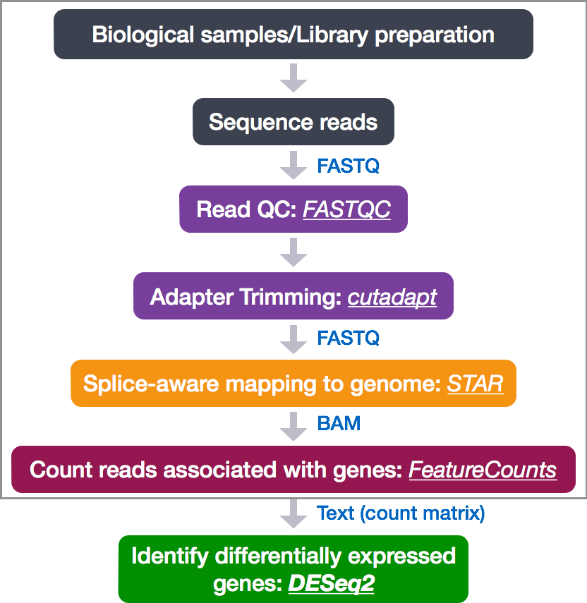
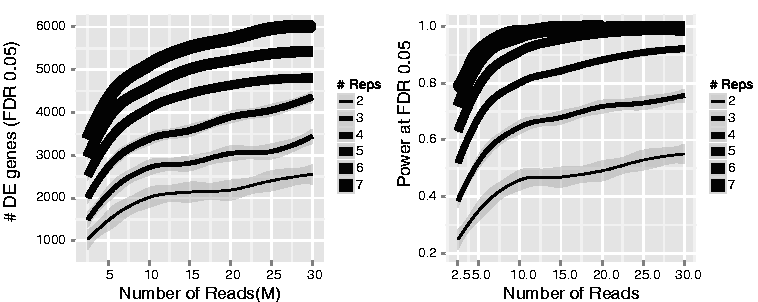

# Differential gene expression analysis with DESeq2

The goal of RNA-Seq is often to perform differential expression testing to determine which genes are expressed at different levels between conditions. These genes can offer biological insight into the processes affected by the condition(s) of interest. 

To determine the expression levels of genes, an RNA-Seq workflow is followed with the steps detailed in the image below. All steps are performed on the command line (Linux/Unix) through the generation of the read counts per gene. The differential expression analysis and any downstream functional analysis are generally performed in R using R packages specifically designed for the complex statistical analyses required to determine whether genes are differentially expressed.




The count data used for differential expression analysis represents the number of sequence reads that originated from a particular gene. The higher the number of counts, the more reads associated with that gene, and the assumption that there was a higher level of expression of that gene in the sample. 


With differential expression analysis, we are looking for genes that change in expression between two or more groups
- case vs. control
- correlation of expression with some variable or clinical outcome

**Why does it not work to identify differentially expressed gene by ranking the genes by how different they are between the two groups (based on fold change values)?**


There are many sources of variation present in your data, and even though the mean expression levels between groups may be quite different, the variation in the data may be so great that the difference in means are not actually significant. This is illustrated for 'GeneA' expression between 'untreated' and 'treated' groups in the figure below. The mean expression level of geneA for the 'treated' group is twice as large as for the 'untreated' group, but the variation between replicates indicates that this may not be a significant difference. **We need to take the variation in the data into account when determining whether genes are differentially expressed.** 


**Essentially, the goal of differential expression analysis is to determine whether the differences in expression (counts) between groups is significant given the variation within groups (replicates) for each gene.** To test for significance, we need an appropriate statistical model that accurately performs normalization (to account for differences in sequencing depth, etc.) and variance modeling (to account for few numbers of replicates and large dynamic expression range). 


## RNA-Seq count distribution

To determine the appropriate statistical model, we need information about the distribution of counts. To get an idea about how RNA-Seq counts are distributed, let's plot the counts for a single sample, 'Mov10_oe_1':

```r
ggplot(data) +
        geom_histogram(aes(x = Mov10_oe_1), stat = "bin", bins = 200)
```


If we zoom in close to zero, we can see a large number of genes with counts of zero:

```r
ggplot(data) +
        geom_histogram(aes(x = Mov10_oe_1), stat = "bin", bins = 200) + 
        xlim(-5, 500) 
```


These images illustrate some common features of RNA-Seq count data, including a **low number of counts associated with the a large proportion of genes**, and a long right tail due to the **lack of any upper limit for expression**. Unlike microarray data, which has a dynamic range maximum limited due to when the probes max out, there is no limit of maximum expression for RNA-Seq data. Due to the differences in these technologies, the statistical models used to fit the data are different between the two methods. 

## Modeling count data

Count data is often modeled using the binomial distribution, which can give you the probability of getting a number of heads upon tossing a coin a number of times. However, not all count data can be fit with the binomial distribution. With some events, like the lottery, when the number of cases is very large (people who buy tickets), but the probability of an event is very small (probability of winning), the Poisson distribution is used to model these types of count data. In these cases, the number of events (people who win) generally range between 1 and 10. [Details provided by Rafael Irizarry in the EdX class.](https://youtu.be/fxtB8c3u6l8)

During RNA-Seq and microarray experiments, a very large number of RNAs are present and the probability of pulling out a particular transcript is very small. However, after taking a large sample, the sum of all counts for that transcript is often between 1 and 10. If this applies, then every gene would follow the Poisson distribution. [A nice description of this concept is presented by Rafael Irizarry in the EdX class.](https://youtu.be/HK7WKsL3c2w)

The Poisson model assumes a normal distribution with the mean of the data equal to the variance, and this model is used to model the log2 of the continuous microarray intensities. However, due to the different properties of the of RNA-Seq count data, such as integer counts instead of continuous measurements and non-normally distributed data, the Poisson model does not accurately model RNA-Seq counts.

If the proportions of mRNA stayed exactly constant between biological replicates for RNA-Seq data, we could expect Poisson distribution. But realistically, biological variation across biological replicates is expected, and, for RNA-Seq data, genes with larger average expression levels tend to have larger observed variances across replicates. This phenomena of 'having different scatter' is known as data *heteroscedasticity*. **The Negative Binomial (NB) model is a good approximation, where this extra variability between replicates is modeled.**


>**NOTE:** 
>
> - **Biological replicates** represent multiple samples (i.e. RNA from different mice) representing the same sample class
> - **Technical replicates** represent the same sample (i.e. RNA from the same mouse) but with technical steps replicated
> - Usually biological variance is much greater than technical variance, so we do not need to account for technical variance to identify biological differences in expression
> - **Don't spend money on technical replicates - biological replicates are much more useful**
 
**How do I know if my data should be modeled using the Poisson distribution or Negative Binomial distribution?** 
If it's count data, it should fit the negative binomial, as discussed previously. However, if you want to verify that your data is appropriate for this model, you can plot the *mean versus the variance* of your data. *Remember for the Poisson model, the mean = variance.*

Run the following code to plot the mean versus variance for the 'Mov10 overexpression' replicates:

```r
mean_counts <- apply(data[, 1:3], 1, mean)
variance_counts <- apply(data[, 1:3], 1, var)
df <- data.frame(mean_counts, variance_counts)

ggplot(df) +
        geom_point(aes(x=mean_counts, y=variance_counts)) + 
        geom_line(aes(x=mean_counts, y=mean_counts, color="red")) +
        scale_y_log10() +
        scale_x_log10()
```


Note that in the figure, the variance across replicates tends to be greater than the mean (red line), especially for genes with large mean expression levels. **This is a good indication that our data do not fit the Poisson distribution and we need to account for this increase in variance using the Negative Binomial model (i.e. Poisson will underestimate variability leading to an increase in false positive DE genes).**

The variance or scatter tends to reduce as we increase the number of biological replicates (variance will approach the Poisson distribution with increasing numbers of replicates). Standard deviations of averages are smaller than standard deviations of individual observations. 

The value of additional replicates is that as you add more data (replicates), you get increasingly precise estimates of group means, and ultimately greater confidence in the ability to distinguish differences between sample classes (i.e. more DE genes).

The figure below illustrates the relationship between sequencing depth and number of replicates on the number of differentially expressed genes identified [[1](https://academic.oup.com/bioinformatics/article/30/3/301/228651/RNA-seq-differential-expression-studies-more)].




# DESeq2 workflow

To model counts appropriately when performing a differential expression analysis, a few different tools are generally employed. **DESeq2** and **EdgeR** both use the negative binomial model and similar methods and, typically, yield similar results. Both of these tools are very sensitive, but may be somewhat stringent at reducing false positives. **Limma voom** is another tool often used for DE analysis, but may be less sensitive for small sample sizes. This tool is recommended when the number of biological replicates per group grows large (e.g. > 20).

**We will be using [DESeq2](https://genomebiology.biomedcentral.com/articles/10.1186/s13059-014-0550-8) for the DE analysis, and the workflow for the tool is shown below in green.** After obtaining the counts associated with each gene, DESeq2 normalizes the count values to account for differences in library sizes and RNA composition between samples. Then, QC is performed at the gene and sample level prior to performing the differential expression analysis.


We will go through the theory of each step in the workflow prior to the hands-on execution of the steps. 
## Normalization

The first step in the workflow is **count normalization**, which is necessary to make accurate comparisons of gene expression between samples. The raw counts, or number of reads aligning to each gene, need to be normalized to account for differences in library depth and composition between samples when performing differential expression analyses.


While normalization is necessary for differential expression analyses, it is also necessary whenever exploring or comparing counts between or within samples. 

Different types of normalization methods exist, and a few of the most common methods include:
 
 - **normalization for library size:** necessary for comparison of expression of the same gene between samples
 
 	
 
 - **normalization for gene length:** necessary for comparison of expression of different genes within the same sample
 
 	
 
 - **normalization for RNA composition:** recommended for comparison of expression between samples (particularly important when performing differential expression analyses)
 
 	>"A few highly and differentially expressed genes may have strong influence on the total read count, causing the ratio of total read counts not to be a good estimate for the ratio of expected counts (for all genes)"[[1](https://genomebiology.biomedcentral.com/articles/10.1186/gb-2010-11-10-r106)]
 
 
### Common normalization measures

Several common normalization measures exist to account for these differences:

- **CPM (counts per million):** counts scaled by total number of reads. This measure accounts for sequencing depth only.
- **TPM (transcripts per kilobase million):** counts per length of transcript (kb) per million reads mapped. This measure accounts for both sequencing depth and gene length.
- **RPKM/FPKM (reads/fragments per kilobase of exon per million reads/fragments mapped):** similar to TPM, as this measure accounts for both sequencing depth and gene length as well; however, it is **not recommended**.
- **Tool-specific metrics for normalization:** 
	- DESeq2 uses a median of ratios method, which accounts for sequencing depth and RNA composition [[1](https://genomebiology.biomedcentral.com/articles/10.1186/gb-2010-11-10-r106)]. 
	- EdgeR uses a trimmed mean of M values (TMM) method that accounts for sequencing depth, RNA composition, and gene length [[2](https://genomebiology.biomedcentral.com/articles/10.1186/gb-2010-11-3-r25)]

### RPKM/FPKM (not recommended)
While TPM and RPKM/FPKM normalization methods both account for sequencing depth and gene length, RPKM/FPKM measures are not recommended. **The reason  is that the normalized count values output by the RPKM/FPKM method are not comparable between samples.** 

Using RPKM/FPKM normalization, the total number of RPKM/FPKM normalized counts for each sample will be different. Therefore, you cannot compare the normalized counts for each gene equally between samples. 

**RPKM-normalized counts table**

| gene | sampleA | sampleB |
| ----- |:-----:|:-----:|
| MOV10 | 5.5 | 5.5 |
| ABCD | 73.4 | 21.8 |
| ... | ... | ... |
|Total RPKM-normalized counts | 1,000,000 | 1,500,000 |

SampleA has a greater proportion of counts associated with MOV10 (5.5/1,000,000) than does sampleB (5.5/1,500,000) even though the RPKM count values are the same. Therefore, we cannot directly compare the counts for MOV10 (or any other gene) between sampleA and sampleB because the total number of normalized counts are different between samples. 

### TPM (recommended)
In contrast to RPKM/FPKM, TPM-normalized counts normalize for both sequencing depth and gene length, but have the same total TPM-normalized counts per sample. Therefore, the normalized count values are comparable both between and within samples.

> *NOTE:* [This video by StatQuest](http://www.rna-seqblog.com/rpkm-fpkm-and-tpm-clearly-explained/) shows in more detail why TPM should be used in place of RPKM/FPKM if needing to normalize for sequencing depth and gene length.

### DESeq2-normalized counts - Median of ratios method
Since tools for differential expression analysis are comparing the counts between sample groups for the same gene, gene length does not need to be accounted for by the tool. However, **sequencing depth** and **RNA composition** do need to be taken into account.

To normalize for sequencing depth and RNA composition, DESeq2 uses the median of ratios method, which performs the following steps when you run the tool:

**Step 1: creates a pseudo-reference sample (row-wise geometric mean)**

For each gene, a pseudo-reference sample is created that is equal to the geometric mean across all samples.

| gene | sampleA | sampleB | pseudo-reference sample  |
| ----- |:-----:|:-----:|:-----:|
| EF2A | 1489 | 906 | sqrt(1489 * 906) = **1161.5** |
| ABCD | 22 | 13 | sqrt(24 * 13) = **17.7** |
| ... | ... | ... | ... |

**Step 2: calculates ratio of each sample to the reference**

For every gene in a sample, the ratios (sample/ref) are calculated (as shown below). This is performed for each sample in the dataset. Since the majority of genes are not differentially expressed, the majority of genes in each sample should have similar ratios within the sample.

| gene | sampleA | sampleB | pseudo-reference sample  | ratio sampleA/ref | ratio sampleB/ref |
| ----- |:-----:|:-----:|:-----:| :-----: | :-----: |
| EF2A | 1489 | 906 | 1161.5 | 1489/1161.5 = **1.28** | 906/1161.5 = **0.78** |
| ABCD | 22 | 13 | 16.9 | 22/16.9 = **1.30** | 13/16.9 = **0.77** |
| MEF3 | 793 | 410 | 570.2 | 793/570.2 = **1.39** | 410/570.2 = **0.72**
| BBC1 | 76 | 42 | 56.5 | 76/56.5 = **1.35** | 42/56.5 = **0.74**
| MOV10 | 521 | 1196 | 883.7 | 521/883.7 = **0.590** | 1196/883.7 = **1.35** |
| ... | ... | ... | ... |

**Step 3: takes sample's median value as that sample's normalization factor**

The median value of all ratios for a single sample is taken as the normalization factor (size factor) for that sample, as calculated below. Notice that the differentially expressed genes should not affect the median value:

`normalization_factor_sampleA <- median(c(0.59, 1.28, 1.3, 1.35, 1.39))`

`normalization_factor_sampleB <- median(c(0.72, 0.74, 0.77, 0.78, 1.35))`
 
The figure below illustrates the median value for the distribution of all gene ratios for a single sample (frequency is on the y-axis).


The median of ratios method makes the assumption that not ALL genes are differentially expressed; therefore, the normalization factors should account for sequencing depth and RNA composition of the sample (large outlier genes will not represent the median ratio values). **This method is robust to imbalance in up-/down-regulation and large numbers of differentially expressed genes.**

**Step 4: divide each raw count value in sample by that sample's normalization factor to generate normalized count values**

For example, if median ratio for SampleA was 1.3 and the median ratio for SampleB was 0.77, you could calculate normalized counts as follows:

SampleA median ratio = 1.3

SampleB median ratio = 0.77

**Raw Counts**

| gene | sampleA | sampleB |  
| ----- |:-----:|:-----:|
| EF2A | 1489 | 906 | 
| ABCD | 22 | 13 | 
| ... | ... | ... | 

**Normalized Counts**

| gene | sampleA | sampleB |
| ----- |:-----:|:-----:|
| EF2A | 1489 / 1.3 = **1145.39** | 906 / 0.77 = **1176.62** | 
| ABCD | 22 / 1.3 = **16.92** | 13 / 0.77 = **16.88** | 
| ... | ... | ... | 

***
**Exercise**

Determine the normalized counts for your gene of interest, PD1, given the raw counts and size factors below. 

NOTE: You will need to run the code below to generate the raw counts dataframe (PD1) and the size factor vector (size_factors), then use these objects to determine the normalized counts values:

```r

# Raw counts for PD1
PD1 <- c(21, 58, 17, 97, 83, 10)
names(PD1) <- paste("Sample", 1:6)
PD1 <- data.frame(PD1)
PD1 <- t(PD1)

# Size factors for each sample
size_factors <- c(1.32, 0.70, 1.04, 1.27, 1.11, 0.85)

```

***

## Quality Control

The next step in the DESeq2 workflow is QC, which includes sample-level and gene-level steps. 


### Sample-level QC

A useful first step in an RNA-seq analysis is often to assess overall similarity between samples: Which samples are similar to each other, which are different? Does this fit to the expectation from the experiment’s design? Log2-transformed normalized counts are used to assess similarity between samples using Principal Component Analysis (PCA) and hierarchical clustering.

Sample-level QC allows us to see how well our replicates cluster together, as well as, observe whether our experimental condition represents the major source of variation in the data. Performing sample-level QC can also identify any sample outliers, which may need to be explored to determine whether they need to be removed prior to DE analysis. 


#### [Principal Component Analysis (PCA)](https://github.com/hbctraining/DGE_workshop/blob/master/lessons/principal_component_analysis.md)

Principal Component Analysis (PCA) is a technique used to emphasize variation and bring out strong patterns in a dataset (dimensionality reduction). Details regarding PCA are given below (based on [materials from StatQuest](https://www.youtube.com/watch?v=_UVHneBUBW0), and if you would like a more thorough description, we encourage you to explore [StatQuest's video](https://www.youtube.com/watch?v=_UVHneBUBW0). 

If you had two samples and wanted to plot the counts of one sample versus another, you could plot the counts of one sample on the x-axis and the other sample on the y-axis as shown below:


You could draw a line through the data in the direction representing the most variation, which is on the diagonal in this example. The maximum variation in the data is between the two endpoints of this line.  

For PCA analysis, it is essentially doing this same thing between all samples, *n*, in *n*-dimensional space. If you have more than three samples, this is hard to visualize, but essentially a line is drawn through the data representing the most variation (PC1). Another line is drawn through the data representing the second most variation in the data (PC2). PC3 represents the direction of the third most variation in the data, and so on and so forth to PC*n*. 

We can plot a sum of the values for each gene based on it's expression (normalized counts) and influence on PC1 and PC2. **If two samples have similar levels of expression for the genes that contribute significantly to the variation represented by PC1, they will be plotted close together on the PC1 axis.** 

Since genes with the greatest variation between samples will have the greatest influence on the principal components, we hope our experimental condition explains this variation (e.g. high counts in one condition and low counts in the other). With PC1 representing the most variation in the data and PC2 representing the second most variation in the data, we can visualize how similar the variation of genes is between samples. **We would expect the treatment groups to separate on PC1 and/or PC2, and the biological replicates to cluster together.** This is easiest to understand by visualizing some PCA plots.

The PCA plot below is what we hope for, with our treatment groups separating on PC1, which explains 89% of the variation in the data. 


We can use other variables present in our metadata to explore the cause of the variation on PC2:


We can determine that the 5% of variation in our data represented by PC2 is due to variation between individuals in this paired design example.

In the following example, we can visualize the samples clustering by genotype on PC2 (13% variance). **If we saw one of the red samples below clustering with the blue samples (or vice versa), we might be worried about a mix-up. It would give us sufficient cause to remove that sample as an outlier and/or do some follow-up tests in the lab.**


We can see that the plasmid expression level represents the major source of variation in the data on PC1 (55% variance).


PCA is also a nice way to look for batch effects. In the below figure, we see batch 1 separate distinctly from batches 2 and 3.


Even if your samples do not separate by PC1 or PC2, you still may return biologically relevant results from the DE analysis, just don't be surprised if you do not return a large number of DE genes. To give more power to detect DE genes, you should account for known major sources of variation in your model. 

***
**Exercise**


The figure below was generated from a time course experiment with sample groups 'Ctrl' and 'Sci' and the following timepoints: 0h, 2h, 8h, and 16h. 

- Determine the sources explaining the variation represented by PC1 and PC2.
- Do the sample groups separate well?
- Do the replicates cluster together for each sample group?
- Are there any outliers in the data?
- Do you have any other concerns regarding the samples in the dataset?


***

#### Hierarchical Clustering Heatmap

Similar to PCA, hierarchical clustering is another, complementary method for identifying strong patterns in a dataset and potential outliers. The heatmap displays the **correlation or distances for all pairwise combinations of samples**. Since the majority of genes are not differentially expressed, samples generally have high correlations with each other (values higher than 0.80). Samples below 0.80 may indicate an outlier in your data and/or sample contamination.

The hierarchical tree can indicate which samples are more similar to each other based on the normalized gene expression values. The color blocks indicate substructure in the data, and you would expect to see your replicates separate together as a block for each sample group.


### Gene-level QC

Prior to differential expression analysis it is beneficial to omit genes that have little or no chance of being detected as differentially expressed. This will increase the power to detect differentially expressed genes. The genes omitted fall into three categories:

- Genes with zero counts in all samples
- Genes with an extreme count outlier
- Genes with a low mean normalized counts


**DESeq2 will perform this filtering by default; however other DE tools, such as EdgeR will not.** It is important to understand what filtering is performed by your tool of choice to know if you need to perform any additional filtering prior to the differential expression analysis.

## Differential expression analysis with DESeq2

The final step in the differential expression analysis is the actual fitting of the raw counts to the statistical model and testing for differentially expressed genes. Essentially we want to determine whether the mean expression levels of two different samplegroups are significantly different.


To determine differentially expressed genes, we are going to use the DESeq2 tool. This tool builds on good ideas for dispersion estimation and use of Generalized Linear Models from the DSS and edgeR methods. The [DESeq2 paper](https://genomebiology.biomedcentral.com/articles/10.1186/s13059-014-0550-8) was published in 2014, but the package is continually updated and available for use in R through Bioconductor.

Differential expression analysis with DESeq2 requires multiple steps, as displayed below.


### Design formula

When performing differential expression analysis, it is a good idea to know what sources of variation are present in your data, either by exploration during the QC or prior knowledge. Once you know the major sources of variation, you can remove them prior to analysis or control for them in the statistical model. For example, if you know that animal sex or age is a significant source of variation in your data, then it needs to be included in your model. The **design formula** or **model formula** needs to have all of the factors in your metadata that account for major sources of variation in your data. The last factor entered in the formula should be the condition of interest. 

For example, suppose you have the following metadata appears as follows:

If you want to examine the expression differences between treatments, and you know that major sources of variation include 'sex' and 'age', then your design formula would be:

`design <- sex + age + treatment`

***
**Exercise**

Suppose you wanted to study the expression difference between the two age groups, and major sources of variation were 'sex' and 'treatment', how would the design formula be written?

***

*** 

age:treatment for complex design formula

***


### Estimate size factors

As you have probably noticed, this is exactly what we did to normalize our counts. DESeq2 will automatically estimate the size factors when performing the differential expression analysis if you haven't already done so. If you have already generated the size factors, then DESeq2 will use these values. **Therefore, you must input the raw counts for analysis.**

### Estimate variation / dispersion

To accurately model our sequencing counts, we need to generate accurate estimates of within-group variation (variation between replicates of the same samplegroup) for each gene. With only a few (3-6) replicates per group, the estimates of variation for each gene are often unreliable. Therefore, DESeq2 shares information across genes to generate more accurate estimates of variation based on the expression level of the gene using a method called 'shrinkage'. DESeq2 assumes that genes with similar expression levels have similar dispersion or variation of expression. DESeq2 generates more accurate measures of dispersion using the following steps:

**Step 1: Estimate the dispersion for each gene separately**

To model the dispersion based on expression level (mean normalized counts of replicates), the dispersion for each gene is estimated using maximum likelihood estimation. Given the normalized count values of the replicates, the most likely estimate of dispersion is calculated.

**Step 2: Fit a curve to the the gene estimates given expression strength**

The idea behind fitting a curve to the data is that different genes will have different scales of biological variability, but, over all genes, there will be a distribution of reasonable estimates of dispersion. 

This curve is displayed as a red line in the figure below, which plots the estimate for the expected dispersion value for genes of a given expression strength. Each black dot is a gene with an associated mean expression level and maximum likelihood estimation (MLE) of the dispersion (Step 1).


**Step 3: Shrink gene-wise dispersion estimates toward the values predicted by the curve**

The curve allows for more accurate identification of differentially expressed genes when sample sizes are small, and the strength of the shrinkage for each gene depends on :
	
- how close gene dispersions are from the curve
- sample size (more samples = less shrinkage)


This shrinkage method is particularly important to reduce false positives in the differential expression analysis. Genes with extremely low levels of variation are shrunken towards the curve, and the more accurate, higher dispersion values are output for differential expression testing. 

Dispersion estimates that are slightly above the curve are also shrunk toward the curve for better dispersion estimation; however, genes with extremely high dispersion values are not shrunken toward the curve due to the likelihood that the gene does not follow the modeling assumptions and has higher variability than others for biological or technical reasons. Shrinking the values toward the curve could result in false positives, so these values are not shrunken. These genes are shown surrounded by blue circles below. 


> **NOTE:** This is a good plot to examine to ensure your data is a good fit for the DESeq2 model. You expect your data to generally scatter around the curve, with the dispersion decreasing with increasing expression levels. If you see a cloud or different shapes, then you might want to explore your data more to see if you have contamination (mitochondrial, etc.) or outlier samples.

### Generalized Linear Model fit for each gene

As discussed earlier, the count data generated by RNA-Seq exhibits overdispersion and the statistical distribution used to model the counts needs to account for this overdispersion. DESeq2 uses a negative binomial distribution to model the RNA-Seq counts using the equation below:

 
 
DESq2 will use this formula to create the model for each gene, but what we really want to know is the log2 foldchanges between conditions. The log2 foldchanges can be estimated using the normalized counts with the formula:

 

By fitting the model, DESeq2 will determine the estimates for the log2 foldchanges between conditions. 

>For example, if we had our samples divided into three conditions, control (ctrl), overexpression (oe) and knockdown (kd), our model would be:
>
> 

In DESeq2 and most other DE tools, you will assign your samples to specific conditions using a 'model matrix' or 'design matrix'. For example, we can assign our samples to conditions in the model matrix using binary (0,1) notation:

|  | ctrl | oe | kd |
| ----- |:-----:|:-----:|:-----:|
| sample1 | 1 | 0 | 0 |
| sample2 | 1 | 0 | 0 |
| sample3 | 0 | 1 | 0 |
| sample4 | 0 | 1 | 0 |
| sample5 | 0 | 0 | 1 |
| sample6 | 0 | 0 | 1 |

Samples 1 and 2 are controls, samples 3 and 4 are overexpression, and samples 5 and 6 are knockdown. This information is utilized to inform the model about which replicates should be used to estimate the **log2 foldchanges (LFC)** for each level of each factor in the model.

>For example, sample1 and sample2 should be used to estimate the LFC for the expression of the control group relative to mean expression of all groups, and the model formula for this comparison would be:
>
>

#### Shrunken log2 foldchanges (LFC)

Generally for count NGS data, there is a large variance associated with the LFC estimates for genes with low read counts, and these weakly expressed genes would be identified as differentially expressed due solely to this variation. To account for this issue and reduce false positives for lowly expressed genes, DESeq2 shrinks the LFC estimates toward zero when the infromation for a gene is low, which could include:

- Low counts and high dispersion values for a gene
- Few replicates per sample group? (few degrees of freedom) - http://www.statsci.org/smyth/pubs/edgeRChapterPreprint.pdf

Similar to the previous shrinkage of dispersion estimates, the shrinkage of LFC estimates uses information from all genes to generate more accurate estimates. Specifically, the distribution of LFC estimates for all genes is used (as a prior) to shrink the LFC estimates of genes with little information or high dispersion toward more likely (lower) LFC estimates.

The effect of dispersion on the shrunken LFC is illustrated in the figure below. Note that the green gene has low dispersion while the purple gene has high levels of dispersion, but the same mean normalized counts. For the green gene with low dispersion, the unshrunken LFC estimate (vertex of the green solid line) is very similar to the shrunken LFC estimate (vertex of the green dotted line), but quite the LFC estimates for the purple gene are quite different due to the high dispersion. So even though two genes can have similar normalized count values, they can have differing degrees of shrinkage. Notice the LFC estimates are shrunken toward the prior (black solid line). 

*Illustration below taken from the [DESeq2 paper](https://genomebiology.biomedcentral.com/articles/10.1186/s13059-014-0550-8).*


> **NOTE:** If very large expected fold changes for a number of individual genes are expected, but not so many large fold changes that the width of the prior adjusts to allow such large fold changes, then you may want to turn off LFC shrinkage using `DESeq(dds, betaPrior=FALSE)`.
>
>The reason is that shrinking of fold changes requires that the software can estimate the range of reasonable values for LFC by looking at the distribution of LFCs (particularly the upper quantile of the absolute LFC). But there might be precise fold changes which are above this upper quantile, and so the prior is too narrow for the targeted genes. The prior might then be a bad assumption for this type of dataset, so it's reasonable to turn it off. *(Response from Mike Love, creator of DESeq2 (http://seqanswers.com/forums/showthread.php?t=49101))*


#### Hypothesis testing using the Wald test

The shrunken LFC estimates for each level of each factor in the design formula relative to mean expression of all groups represent the **model coefficients**, and these coefficients are calculated regardless of the comparison of interest. The model coefficients can be viewed with `coefficients(dds)` to explore the strength of the effect for each factor group for every gene.

However, generally we are interested in the LFC estimates relative to other sample groups instead of to the mean expression of all groups. To indicate to DESeq2 the groups we want to compare whether the expression of genes are significantly different, we can use **contrasts**. 
These can be provided to DESeq2 a couple of different ways.

To determine whether the shrunken LFC estimate differs significantly from zero, the Wald test is used.

##Fold change shrinkage (Fisher info: degrees of freedom (number of samples, number of betas), estimated mean counts, dispersion estimate); beta prior (briefly - if very few reps and high variation within gene); Wald testing; LRT testing; exercises
 


To determine whether the model estimate (LFC) differs significantly from zero, the shrunken LFC estimate is divided by it's standard error to generate a z-statistic, which is compared to the normal distribution.
