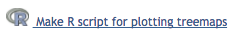
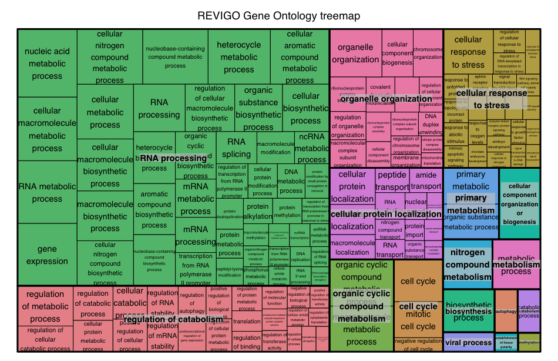

## gProfileR

[gProfileR](http://biit.cs.ut.ee/gprofiler/index.cgi) is another tool for performing ORA, similar to clusterProfiler. gProfileR considers multiple sources of functional evidence, including Gene Ontology terms, biological pathways, regulatory motifs of transcription factors and microRNAs, human disease annotations and protein-protein interactions. The user selects the organism and the sources of evidence to test. There are also additional parameters to change various thresholds and tweak the stringency to the desired level. 

The GO terms output by gprofileR are generally quite similar to those output by clusterProfiler, but there are small differences due to the different algorithms used by the tools.


You can use gProfiler for a wide selection of organisms, and the tool accepts your gene list as input. If your gene list is ordered (e.g. by padj. values), then gProfiler will take the order of the genes into account when outputting enriched terms or pathways.

In addition, a large number (70%) of the functional annotations of GO terms are determined using _in silico_ methods to infer function from electronic annotation (IEA). While these annotations can offer valuable information, the information is of lower confidence than experimental and computational studies, and these functional annotations can be easily filtered out. 

The color codes in the gProfiler output represent the quality of the evidence for the functional annotation. For example, weaker evidence is depicted in blue, while strong evidence generated by direct experiment is shown with red or orange. Similar coloring is used for pathway information, with well-researched pathway information shown in black, opposed to lighter colors. Grey coloring suggests an unknown gene product or annotation. For more information, please see the [gProfiler paper](http://www.ncbi.nlm.nih.gov/pmc/articles/PMC1933153/).

Also, due to the hierarchical structure of GO terms, you may return many terms that seem redundant since they are child and parent terms. gProfiler allows for 'hierarchical filtering', returning only the best term per parent term.

We encourage you to explore gProfiler online, for today's class we will be demonstrating how to run it using the R package.

#### Running gProfiler

We can run gProfileR relatively easily from R, by loading the library and running the  `gprofiler` function.

```r
source("http://bioconductor.org/biocLite.R") 
biocLite(c("gProfiler", "treemap"))
library(gProfiler)
library(treemap)

## Running gprofiler to identify enriched processes among significant genes

gprofiler_results_oe <- gprofiler(query = sigOE_genes), 
                                  organism = "hsapiens",
                                  ordered_query = F, 
                                  exclude_iea = F, 
                                  max_p_value = 0.05, 
                                  max_set_size = 0,
                                  correction_method = "fdr",
                                  hier_filtering = "none", 
                                  domain_size = "annotated",
                                  custom_bg = all_genes)

```

Let's save the gProfiler results to file:

```r
## Subset and reorder gProfiler results to only include columns of interest
gprofiler_results_oe_reordered <- gprofiler_results_oe[, c("term.id", "domain", "term.name", "p.value", "overlap.size", "term.size", "intersection")]

## Order the results by p-adjusted value
gprofiler_results_oe_reordered <- gprofiler_results_oe_reordered[order(gprofiler_results_oe_reordered$p.value), ]

## Extract only the 'GO' terms from the results
gprofiler_results_oe_GOs <- gprofiler_results_oe_reordered[grep('GO:', gprofiler_results_oe_reordered$term.id), ]

## Write the enriched GO results to file
write.csv(gprofiler_results_oe_GOs, 
            "results/gprofiler_MOV10_oe.csv")
```

Now, extract only those lines in the gProfiler results with GO term accession numbers and associated padj values for downstream analyses:

```r
## Extract only GO IDs and p-values for downstream analysis

GOpval_oe <- gprofiler_results_oe_GOs[ , c("term.id", "p.value")]

write.table(GOpval_oe, "results/GOs_oe.txt", quote=FALSE, row.names = FALSE, col.names = FALSE)

```

### REVIGO

[REVIGO](http://revigo.irb.hr/) is a web-based tool that can take our list of GO terms, collapse redundant terms by semantic similarity, and summarize them graphically. 


Open `GOs_oe.txt` and copy and paste the contents into the REVIGO search box, and submit.

After the program runs, there may not be output to the screen, but you can click on the `Treemap` tab. At the bottom of the `Treemap` tab should be a link to an R script to create the treemap; click to download the script.



In RStudio, pull-down the `File` menu and choose `Open File`, then navigate to the `REVIGO_treemap.r` script to open. In the `REVIGO_treemap.r` script tab, scroll down the script to the end and replace with the following:

```r
## by default, outputs to a PDF file
pdf( file="results/revigo_treemap.pdf", width=16, height=9 ) # rename to appropriate path and file name

## change the `tmPlot()` command to `treemap()`
treemap(
	stuff,
	index = c("representative","description"),
	vSize = "abslog10pvalue",
	type = "categorical",
	vColor = "representative",
	title = "REVIGO Gene Ontology treemap",
	inflate.labels = FALSE,      # set this to TRUE for space-filling group labels - good for posters
	lowerbound.cex.labels = 0,   # try to draw as many labels as possible (still, some small squares may not get a label)
	bg.labels = "#CCCCCCAA",     # define background color of group labels
												       # "#CCCCCC00" is fully transparent, "#CCCCCCAA" is semi-transparent grey, NA is opaque
	position.legend = "none"
)
```




### Gene set enrichment analysis using GAGE and Pathview

Gene set enrichment analysis using [GAGE (Generally Applicable Gene-set Enrichment for Pathway Analysis)](http://bioconductor.org/packages/release/bioc/html/gage.html) and [Pathview](http://bioconductor.org/packages/release/bioc/html/pathview.html) tools was also performed using a slightly different type of algorithm.

"GAGE assumes a gene set comes from a different distribution than the background and uses two-sample t-test to account for the gene set specific variance as well as the background variance. The two-sample t-test used by GAGE identifies gene sets with modest but consistent changes in gene expression level."[[2](http://bmcbioinformatics.biomedcentral.com/articles/10.1186/1471-2105-10-161)]

Pathview allows for the integration of the data generated by GAGE and visualization of the pathways from the dataset.


#### Exploring enrichment of KEGG pathways
To get started with GAGE and Pathview analysis, we need to load multiple libraries:

```r
# Install packages if this is your first time using them

source("http://bioconductor.org/biocLite.R") 
biocLite('gage', 'pathview', 'gageData', 'biomaRt', 'org.Hs.eg.db', 'DOSE', 'SPIA') 

# Loading the packages needed for GAGE and Pathview analysis

library(gage)
library(pathview)
library(gageData)
library(org.Hs.eg.db)
```

To determine whether pathways in our dataset are enriched, we need to first obtain the gene sets to test:

```r
# Create datasets with KEGG gene sets to test

kegg_human <- kegg.gsets(species = "human", id.type = "kegg")
names(kegg_human)

kegg.gs <- kegg_human$kg.sets[kegg_human$sigmet.idx]
head(kegg.gs)
```

Now that we have our pathways to test, we need to bring in our own data. We will use the log2 fold changes output by differential expression analysis to determine whether particular pathways are enriched. GAGE requires the genes have Entrez IDs, so we will used these IDs for the analysis. 

> A useful tutorial for using GAGE and Pathview is available from Stephen Turner on R-bloggers: [http://www.r-bloggers.com/tutorial-rna-seq-differential-expression-pathway-analysis-with-sailfish-deseq2-gage-and-pathview/](http://www.r-bloggers.com/tutorial-rna-seq-differential-expression-pathway-analysis-with-sailfish-deseq2-gage-and-pathview/)

The [GAGE vignette](https://www.bioconductor.org/packages/devel/bioc/vignettes/gage/inst/doc/gage.pdf) provides detailed information on running the analysis. Note that you can run the analysis and look for pathways with genes statistically only up- or down-regulated. Alternatively, you can explore statistically perturbed pathways, which are enriched in genes that may be either up- or down- regulated. For KEGG pathways, looking at both types of pathways could be useful.

```r
# Run GAGE

keggres = gage(foldchanges, gsets=kegg.gs, same.dir=T)
names(keggres)

head(keggres$greater) #Pathways that are up-regulated

head(keggres$less) #Pathways that are down-regulated

# Explore genes that are up-regulated

sel_up <- keggres$greater[, "q.val"] < 0.05 & !is.na(keggres$greater[, "q.val"])

path_ids_up <- rownames(keggres$greater)[sel_up]
path_ids_up

# Get the pathway IDs for the significantly up-regulated pathways

keggresids = substr(path_ids_up, start=1, stop=8)
keggresids
```
Now that we have the IDs for the pathways that are significantly up-regulated in our dataset, we can visualize these pathways and the genes identified from our dataset causing these pathways to be enriched using [Pathview](https://www.bioconductor.org/packages/devel/bioc/vignettes/pathview/inst/doc/pathview.pdf). 

```r
# Run Pathview

## Use Pathview to view significant up-regulated pathways

pathview(gene.data = foldchanges, pathway.id=keggresids, species="human", kegg.dir="results/")
```


#### Exploring enrichment of biological processes using GO terms in GAGE
Using the GAGE tool, we can identify significantly enriched gene ontology terms for biological process and molecular function based on the log2 fold changes for all genes. While gProfileR is an overlap statistic analysis tool which uses a threshold (adjusted p<0.05 here) to define which genes are analyzed for GO enrichment, gene set enrichment analysis tools like GAGE use a list of genes (here ranked by logFC) without using a threshold. This allows GAGE to use more information to identify enriched biological processes. The introduction to GSEA goes into more detail about the advantages of this approach: [http://www.ncbi.nlm.nih.gov/pmc/articles/PMC1239896/](http://www.ncbi.nlm.nih.gov/pmc/articles/PMC1239896/).

```r
#Acquire datasets

data(go.sets.hs)
head(names(go.sets.hs))

data(go.subs.hs)
names(go.subs.hs)
head(go.subs.hs$MF)

#Use gage to explore enriched biological processes
#Biological process 

go_bp_sets = go.sets.hs[go.subs.hs$BP]
```

> If we wanted to identify enriched molecular functions we would use the code: `go.sets.hs[go.subs.hs$MF]`


```r
# Run GAGE
go_bp_res = gage(foldchanges, gsets=go_bp_sets, same.dir=T)
class(go_bp_res)
names(go_bp_res)
head(go_bp_res$greater)
go_df_enriched <- data.frame(go_bp_res$greater)

GO_enriched_BP <- subset(go_df_enriched, q.val < 0.05)
GO_enriched_BP

write.table(GO_enriched_BP, "Mov10_GAGE_GO_BP.txt", quote=F)
```


***
*This lesson has been developed by members of the teaching team at the [Harvard Chan Bioinformatics Core (HBC)](http://bioinformatics.sph.harvard.edu/). These are open access materials distributed under the terms of the [Creative Commons Attribution license](https://creativecommons.org/licenses/by/4.0/) (CC BY 4.0), which permits unrestricted use, distribution, and reproduction in any medium, provided the original author and source are credited.*

